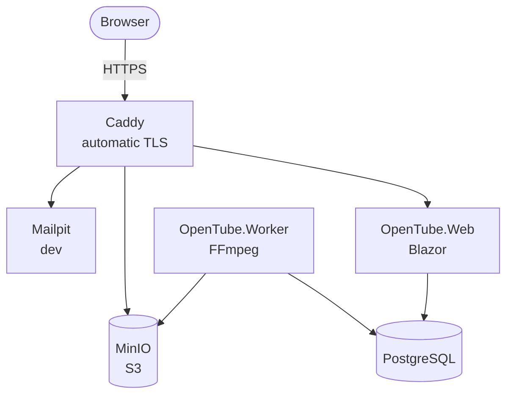

# OpenTube

**English** · [Português](README.pt.md)

Private video platform — an "internal YouTube" where every piece of content starts out private and
access is granted explicitly: open to everyone, targeted at specific people or at an entire email
domain, with optional expiration and a detailed record of who watched what.

---

## Contents

- [Overview](#overview)
- [Access model](#access-model)
- [Architecture](#architecture)
- [Video pipeline](#video-pipeline)
- [Analytics](#analytics)
- [Per-video support](#per-video-support)
- [Stack](#stack)
- [Repository layout](#repository-layout)
- [Running](#running)
- [Tests](#tests)
- [Security and privacy](#security-and-privacy)
- [Roadmap](#roadmap)

---

## Overview

| Feature | Description |
| --- | --- |
| Home | List of videos visible to the current viewer, with search |
| Upload | Direct upload from the browser to storage, bypassing the application server |
| Visibility | Every video starts **private**; the administrator promotes it to public or restricted |
| Invitations | Email with an access link and a 6-digit code — no password |
| Domains | Dedicated entry page per DNS-verified domain |
| Validity | Access forever, until a date, or for a period after first use |
| Analytics | Who watched, when, from where, on which device, and how much of each video |
| Support | Private comments per video, visible only to the author and the administrator |

---

## Access model

### Video visibility

| State | Who can see it |
| --- | --- |
| `Private` | Administrators only. The default for every upload. |
| `Public` | Any visitor, no authentication required. |
| `Restricted` | Only those holding a valid access grant. |

### Grants (`AccessGrant`)

The four kinds of access are the same entity with different subjects:

| Subject | Meaning |
| --- | --- |
| `User` | A specific email address (`allan@barcelos.dev`) |
| `Domain` | Any email address from a verified domain (`barcelos.dev`) |
| `Link` | Whoever holds a secret share token |
| `Public` | Any visitor |

Each grant targets a **video**, a **collection**, or **the whole library**, and carries a validity
window (`starts_at` / `expires_at`, null = forever), an optional view limit, a download permission,
and a revocation record.

The view limit is counted on the master playlist, with a conditional increment in the database
that keeps simultaneous playbacks from going over the cap. When the view is counted, the
application issues a signed ticket (one cookie per video, valid for the video's duration plus a
margin) that lets the rest of that playback — renditions, segments, captions — through even when
it used up the last view. The ticket does not start a new playback and does not survive revocation.

The decision lives in a single function, `CanWatch(viewer, video)` — the whole application (home,
search, player, captions, thumbnail, download) goes through it. It is the most heavily tested part
of the system, because a mistake there leaks confidential content.

### Passwordless authentication

No password is ever generated, transmitted, or stored. The invitation carries a **single-use link**
and a **6-digit code** (for when the email client breaks the link). Both are stored only as hashes
and expire in 15 minutes (code) and 7 days (invitation). The first use creates a 30-day cookie
session, which is renewable and can be revoked immediately by the administrator.

### Domain access

1. The administrator registers `barcelos.dev` and receives a verification token.
2. Whoever manages the domain publishes `TXT _opentube-verify.barcelos.dev = <token>`.
3. Once the record is verified, the system opens the entry page `/entry/barcelos.dev`.
4. Visitors to that page enter an email address from the domain and receive the code by email.

DNS verification exists so that nobody can register a domain they do not control. Sending and
checking codes are rate-limited (by IP, email, and domain), the only barrier against brute-forcing
a 6-digit code.

---

## Architecture



Files are uploaded **directly from the browser to MinIO** through signed multipart URLs, without
passing through the application. The worker is the only component that scales with CPU, which is
why it has lived in its own container from day one.

---

## Video pipeline

1. **Upload** — the application creates the video record in `Draft` and returns signed URLs; the
   browser sends the parts straight to the `originals` bucket; on completion, the transcoding job
   is queued.
2. **Probe** — `ffprobe` extracts duration, resolution, and codecs, and rejects invalid files early.
3. **Transcode** — FFmpeg produces an adaptive ladder (360p to 1080p, never above the source
   resolution) in CMAF/fMP4, with 4 s segments and keyframes aligned across renditions.
4. **Derivatives** — thumbnail, sprite sheet for seek-bar previews and, if a transcriber is
   configured, automatic captions. Without the executable, this step is off.
5. **Publish** — state `Ready`, video available according to its visibility.

The original is kept in the `originals` bucket so the video can be reprocessed. Each processing run
writes to a new folder (`<video>/r-<generation>/`) and only switches the version in use once
everything has been uploaded: reprocessing does not take the video offline, a failure midway keeps
the previous version, and old generations are deleted after the switch. Captions live outside the
generations. An interrupted job (worker restarted midway) is resumed on the next attempt.

### Authorized delivery

The HLS playlist is served by an application endpoint that checks access. Under `make watch` the
manifest carries short-lived signed URLs, because the browser talks to MinIO directly. In the local
stack (`make up`) and in production, Caddy authorizes every segment with `forward_auth`: the
application decides, Caddy moves the bytes. Revoking access takes effect on the next segment
instead of waiting for a signature to expire. The original still goes through a signed URL, on the
`/originals` path.

On content protection, plainly: without DRM, anyone with legitimate access can download. What works
in practice is short-lived tokens, a limit on simultaneous sessions per user, a dynamic watermark
with the viewer's email, and a complete access log. CMAF packaging keeps the door open to add DRM
later without rewriting anything.

---

## Analytics

The player sends a heartbeat every 10 seconds with the interval watched since the previous one,
using `sendBeacon` so it survives the tab being closed. Storing **intervals** instead of a percentage
is what makes it possible to answer "did they skip this part?" and to draw the retention curve
second by second.

A periodic job merges the intervals per session (a union of ranges, so rewatching is not counted
twice) and aggregates them into daily tables, keeping the dashboard instant even with millions of
events.

**Dashboards:** per video (retention, completion, devices, errors), per user (full timeline), per
domain, and per invitation — the last one answering "I invited 12, 7 opened, 5 watched, 2
finished", which is usually the metric that actually matters. CSV export.

---

## Per-video support

Comments work as a help desk: each conversation belongs to a (video, user) pair, can be anchored to
a moment in the video, and is visible only to the author and to administrators. It has a status
(`open`, `answered`, `closed`) and email notifications in both directions.

---

## Stack

| Layer | Technology |
| --- | --- |
| Application | .NET 10, Blazor Web App (SSR + `InteractiveServer` in the admin area) |
| UI | Bootstrap 5.3 with the default palette |
| Database | PostgreSQL 17, EF Core for the domain and Dapper for aggregations |
| Storage | MinIO (S3 API), `originals` and `vod` buckets |
| Media | FFmpeg in a dedicated worker, HLS/CMAF, `hls.js` player |
| Queue | Job table in PostgreSQL with `FOR UPDATE SKIP LOCKED` |
| Email | `IEmailSender` abstraction; Mailpit in development |
| Search | `tsvector` with the Portuguese dictionary and `pg_trgm` |
| Proxy | Caddy with automatic TLS |

---

## Repository layout

```
Makefile                      local targets (there is no `make dev`)
install.sh / uninstall.sh     production on Docker Swarm
docker-compose.yml            full stack in containers
docker-compose.dev.yml        publishes the dependencies' ports on the host
Caddyfile
scripts/                      .env generation, `dotnet watch` environment, Swarm entrypoint
src/
  OpenTube.Shared/            shared contracts and DTOs
  OpenTube.Domain/            entities and access rules (no infrastructure dependencies)
  OpenTube.Infrastructure/    EF Core, S3 storage, email, DNS verification, queue
  OpenTube.Web/               Blazor: home, search, player, and admin area
  OpenTube.Worker/            transcoding, derivatives, and analytics aggregation
tests/
  OpenTube.Domain.Tests/
  OpenTube.Infrastructure.Tests/
  OpenTube.Worker.Tests/
  OpenTube.Web.Tests/
  OpenTube.TestSupport/
```

---

## Running

**Requirements:** Docker and the .NET 10 SDK.

There is no database user, password, or key in the repository. The first time, `make` generates
`.env` (mode 600); after that it reuses the file. There is no `make dev` target.

The interface is available in English, Portuguese, and French. English is the base: it is what
shows up when the browser asks for no other language and when a translation is missing. The menu
switches the language and remembers the choice in a cookie.

| Command | What starts | Environment | Code |
| --- | --- | --- | --- |
| `make watch` | Database, MinIO, and Mailpit in containers; app and worker on the host | `Development` | `dotnet watch`, reloads on save |
| `make up` / `make up-d` | Full stack in containers, with Caddy | `Development` | Prebuilt image, no hot reload |
| `sudo bash install.sh` | Single-node Swarm | `Production` | Images built on the server |

`make` on its own lists the targets.

### Development (`make watch`)

This is the development mode. Only the dependencies run in containers; the app and the worker run
on your machine, with `ASPNETCORE_ENVIRONMENT=Development`.

```bash
make watch
```

| Service | Address |
| --- | --- |
| Application | http://localhost:5080 |
| Worker | local process |
| MinIO (console) | http://localhost:9001 |
| Mailpit | http://localhost:8025 |
| PostgreSQL | `localhost:5432` |

The browser uploads files straight to MinIO at `localhost:9000`. Username and password are in
`.env`. The administrator is the email in `src/OpenTube.Web/appsettings.Development.json`; the
sign-in code lands in Mailpit. Ctrl+C stops the app and the worker. The containers keep running
until `make deps-down`.

`make watch-web` and `make watch-worker` start each process on its own, with the dependencies
already up.

### Local stack (`make up`)

Starts everything in containers, also with `ASPNETCORE_ENVIRONMENT=Development`, but without
reloading when the code changes. Use it to see the application behind Caddy, with per-segment
authorization.

```bash
make up-d
```

| Service | Address |
| --- | --- |
| Application | https://localhost |
| Mailpit | http://localhost:8025 |
| Credentials | `.env` |

The `localhost` certificate is internal. The browser warns once — that is expected. Here the
administrator is `OPENTUBE_ADMIN_EMAIL` from `.env` (the generator suggests `admin@localhost`), not
the email from `appsettings.Development.json`.

A volume created with the old fixed user does not accept the new password: PostgreSQL only applies
the password on first initialization. `make clean` deletes that volume so the database starts fresh.

### Production

```bash
sudo bash install.sh
```

The installer brings up a single-node Docker Swarm, generates the user, password, and keys, and
stores them only as Swarm secrets. None of it goes to disk or to the repository. The first time, a
summary is printed to the terminal; copy it and keep it safe. Running it again does not replace
secrets that already exist.

The environment inside the containers is `Production`. To deploy new code, update the checkout and
run `/opt/<name>/scripts/update.sh`. To remove what the installer created: `sudo bash uninstall.sh`.

Automatic transcription reads `Transcription__Executable` and `Transcription__ModelPath` in the
worker. Leaving both empty turns the feature off, which is the default: it is the most expensive
step in the pipeline.

> **About the MinIO image:** public MinIO images are no longer distributed through Docker Hub or
> quay.io. `docker-compose.yml` uses the last published community release, which is enough for
> development. In production, use the official registry with credentials or switch to any other
> S3-compatible server (SeaweedFS, Garage, Amazon S3): the application talks only through the S3
> API, behind the `IVideoStorage` interface.

---

## Tests

```bash
dotnet test
```

Each roadmap phase is only considered done when its suite is green. The sensitive logic lives in
pure classes (access rules, interval merging, transcoding ladder calculation, rate limiter),
testable without a database or network; the rest uses ephemeral containers.

---

## Security and privacy

- No password is generated or sent by email.
- Codes and tokens are stored only as hashes, single-use and short-lived.
- Rate limiting on sending and checking codes, with progressive lockout. Each code attempt is
  reserved in the database before the comparison, so parallel requests cannot exceed the limit,
  and a code or link opens only one session.
- Behind Caddy, the real address and protocol come from `X-Forwarded-For` and `X-Forwarded-Proto`,
  accepted only from private networks (configurable in `ReverseProxy:TrustedNetworks`). Without
  this, per-origin limits would apply to the whole site and cookies would lack the secure flag.
- Audience collection limited per origin and per batch size.
- IP recorded as a hash with a rotating secret; the country is kept, not the address.
- Raw playback events retained for 24 months; aggregates are kept.
- Deleting a user anonymizes their events instead of removing them.
- Audit log of every administrative action: grant, revoke, publish, delete.
- Explicit notice to the guest, on first access, that viewing is recorded.

---

## Roadmap

| Phase | Scope | Status |
| --- | --- | --- |
| 1 | Core: upload, transcoding, player, home, and search | **done** |
| 2 | Access: grants, invitations, and collections | **done** |
| 3 | Domains: DNS verification and dedicated entry page | **done** |
| 4 | Analytics: collection, aggregation, dashboards, and export | **done** |
| 5 | Support: private conversations per video | **done** |
| 6 | Polish: automatic captions, watermark, audit, per-segment authorization | **done** |

---

## License

Private use.
