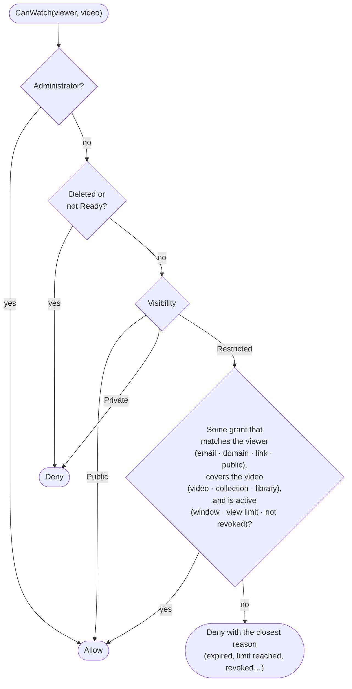
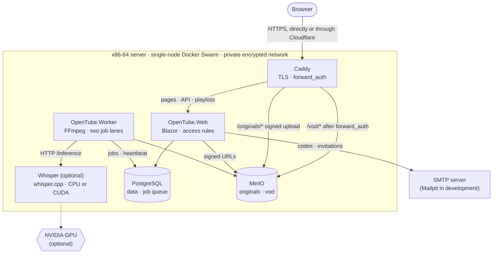
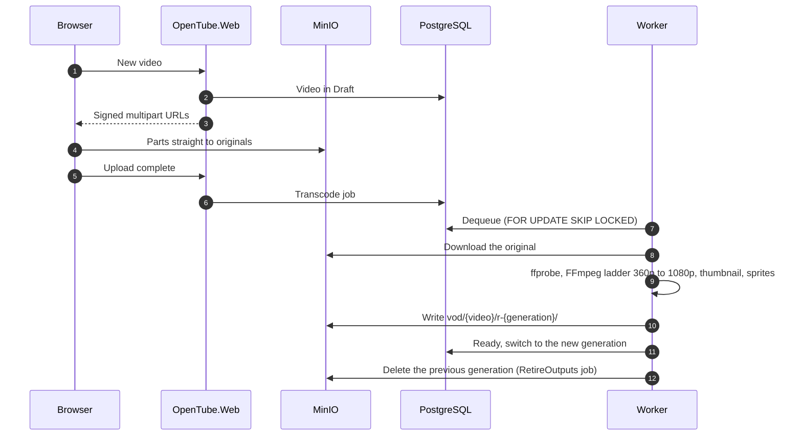
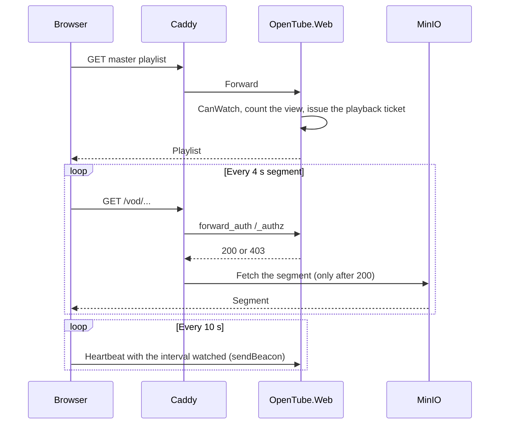
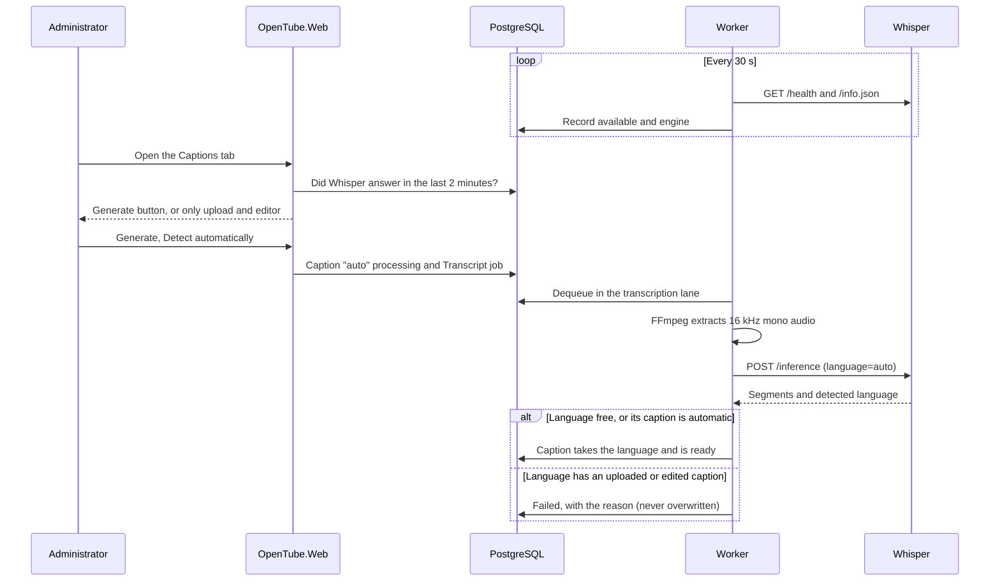

# OpenTube

**English** · [Português](README.pt.md)

Private video platform — an "internal YouTube" where every piece of content starts out private and
access is granted explicitly: open to everyone, targeted at specific people or at an entire email
domain, with optional expiration and a detailed record of who watched what.

---

## Contents

- [Server requirements](#server-requirements)
- [Overview](#overview)
- [Access model](#access-model)
- [Architecture](#architecture)
- [Video pipeline](#video-pipeline)
- [Analytics](#analytics)
- [Captions](#captions)
- [Per-video support](#per-video-support)
- [Stack](#stack)
- [Repository layout](#repository-layout)
- [Running](#running)
- [Tests](#tests)
- [Security and privacy](#security-and-privacy)
- [Roadmap](#roadmap)
- [Use of AI in development](#use-of-ai-in-development)

---

## Server requirements

Everything runs on a single machine (single-node Docker Swarm): PostgreSQL, MinIO, the application,
the worker (FFmpeg), Caddy, and — when automatic captions are on — Whisper. What varies is how long
the heavy work takes: transcoding each upload and transcribing the speech.

| | Minimum | Recommended | Ideal |
| --- | --- | --- | --- |
| **For** | Trying it out, small library, few viewers | Day-to-day use by a team or company, no GPU | Large library, frequent uploads, best captions |
| **CPU** | 2 vCPU (x86-64) | 8 vCPU, recent generation (AVX2 / AVX-512) | 8+ vCPU |
| **Memory** | 4 GB | 16 GB | 32 GB |
| **GPU** | — | — | NVIDIA with ≥ 6 GB VRAM, Pascal or newer (T4, L4, A10, RTX 3060+) |
| **System disk** | 40 GB SSD | 80 GB NVMe SSD | 100 GB NVMe SSD |
| **Video storage** | As needed (see below) | Separate disk or volume | Separate disk or volume, with backup |
| **Network** | 100 Mbps | 1 Gbps | 1 Gbps or more |
| **Automatic captions** | Optional; `base-q5_1` (fast, basic quality) | `small` on the CPU | `large-v3-turbo-q5_0` on the GPU, the most accurate |
| **Whisper image** | `whisper:cpu` | `whisper:cpu` | `whisper:cuda` |

The Whisper container reads the machine on start and picks the model and threads on its own (table
in [Automatic captions in production](#automatic-captions-in-production)); nothing needs to be
configured by hand. On the minimum machine, leaving captions off is also a valid choice: captions
can still be uploaded or written in the editor.

**Operating system:** a recent 64-bit Linux on x86-64/amd64 (the architecture of the published images), with `apt` (Ubuntu 22.04/24.04 or Debian 12). The
installer installs Docker, UFW, and — on the ideal machine — the NVIDIA Container Toolkit. The GPU
needs the NVIDIA driver already installed (`nvidia-smi` working on the host).

**Video storage.** Each video is kept twice: the original (to allow reprocessing) and the adaptive
versions. From a 1080p source the versions add up to about 10.5 Mbit/s — **roughly 4.7 GB per hour
of video**, plus the original (typically 1 to 4 GB per hour). Plan for **6 to 9 GB per hour of
1080p**; lower-resolution sources take less, since the ladder never goes above the source.

**What each tier means in practice** (rough figures, they vary with the content):

- **Transcoding** uses the CPU only (FFmpeg, `veryfast` preset); the GPU does not speed it up. On 2
  vCPU, one hour of 1080p takes on the order of an hour or more; on 8 vCPU, a fraction of that.
- **Transcription** runs in its own lane, so it never delays transcoding. On 2 vCPU with
  `base-q5_1`, expect around real time or slower; on 8 vCPU with `small`, several times faster than
  real time; on the GPU with `large-v3-turbo`, an hour of audio in a few minutes, with the best
  accuracy.
- **Viewing** costs little on the server: segments are static files served by Caddy from MinIO.
  The limit there is the upload bandwidth — each 1080p viewer takes up to about 5 Mbit/s.

---

## Overview

| Feature | Description |
| --- | --- |
| Home | List of videos visible to the current viewer, with search |
| Upload | Direct upload from the browser to storage, bypassing the application server |
| Visibility | Every video starts **private**; the administrator promotes it to public or restricted |
| Invitations | Email with an access link and a 6-digit code — no password |
| Domains | Dedicated entry page per DNS-verified domain |
| Validity | Access forever, until a date, or for a period after first use |
| Analytics | Who watched, when, from where, on which device, and how much of each video |
| Support | Private comments per video, visible only to the author and the administrator |
| Collections | Videos grouped into collections; access can be granted per video, collection, or the whole library |
| Captions | Per-language tab: automatic with Whisper (language detected on its own), upload, and an in-app editor |
| Protection | Moving watermark with the viewer's email, library PNG watermark, no download or casting, limit on simultaneous playbacks |
| Audit | Every administrative action is recorded: grant, revoke, publish, delete |
| Languages | Interface in English, Portuguese, and French |

---

## Access model

### Video visibility

| State | Who can see it |
| --- | --- |
| `Private` | Administrators only. The default for every upload. |
| `Public` | Any visitor, no authentication required. |
| `Restricted` | Only those holding a valid access grant. |

### Grants (`AccessGrant`)

The four kinds of access are the same entity with different subjects:

| Subject | Meaning |
| --- | --- |
| `User` | A specific email address (`allan@barcelos.dev`) |
| `Domain` | Any email address from a verified domain (`barcelos.dev`) |
| `Link` | Whoever holds a secret share token |
| `Public` | Any visitor |

Each grant targets a **video**, a **collection**, or **the whole library**, and carries a validity
window (`starts_at` / `expires_at`, null = forever), an optional view limit, a download permission,
and a revocation record.

The view limit is counted on the master playlist, with a conditional increment in the database
that keeps simultaneous playbacks from going over the cap. When the view is counted, the
application issues a signed ticket (one cookie per video, valid for the video's duration plus a
margin) that lets the rest of that playback — renditions, segments, captions — through even when
it used up the last view. The ticket does not start a new playback and does not survive revocation.

The decision lives in a single function, `CanWatch(viewer, video)` — the whole application (home,
search, player, captions, thumbnail, download) goes through it. It is the most heavily tested part
of the system, because a mistake there leaks confidential content.



### Passwordless authentication

No password is ever generated, transmitted, or stored. The invitation carries a **single-use link**
and a **6-digit code** (for when the email client breaks the link). Both are stored only as hashes
and expire in 15 minutes (code) and 7 days (invitation). The first use creates a 30-day cookie
session, which is renewable and can be revoked immediately by the administrator.

### Domain access

1. The administrator registers `barcelos.dev` and receives a verification token.
2. Whoever manages the domain publishes `TXT _opentube-verify.barcelos.dev = <token>`.
3. Once the record is verified, the system opens the entry page `/entry/barcelos.dev`.
4. Visitors to that page enter an email address from the domain and receive the code by email.

DNS verification exists so that nobody can register a domain they do not control. Sending and
checking codes are rate-limited (by IP, email, and domain), the only barrier against brute-forcing
a 6-digit code.

---

## Architecture



Files are uploaded **directly from the browser to MinIO** through signed multipart URLs, without
passing through the application (in production through Caddy, on the `/originals` path). The
worker is the only component that scales with CPU, which is why it has lived in its own container
from day one; it runs two lanes, so a long transcription never holds back a transcode. Everything
talks over the stack's private overlay network; only Caddy publishes a port. Whisper, for automatic captions, runs in a
container of its own too, and is optional (see [Automatic captions in production](#automatic-captions-in-production)).

---

## Video pipeline

1. **Upload** — the application creates the video record in `Draft` and returns signed URLs; the
   browser sends the parts straight to the `originals` bucket; on completion, the transcoding job
   is queued.
2. **Probe** — `ffprobe` extracts duration, resolution, and codecs, and rejects invalid files early.
3. **Transcode** — FFmpeg produces an adaptive ladder (360p to 1080p, never above the source
   resolution) in CMAF/fMP4, with 4 s segments and keyframes aligned across renditions.
4. **Derivatives** — thumbnail and sprite sheet for seek-bar previews. Captions are requested
   separately, per language (see [Captions](#captions)).
5. **Publish** — state `Ready`, video available according to its visibility.



The original is kept in the `originals` bucket so the video can be reprocessed. Each processing run
writes to a new folder (`<video>/r-<generation>/`) and only switches the version in use once
everything has been uploaded: reprocessing does not take the video offline, a failure midway keeps
the previous version, and old generations are deleted after the switch. Captions live outside the
generations. An interrupted job (worker restarted midway) is resumed on the next attempt.

### Authorized delivery

The HLS playlist is served by an application endpoint that checks access. Under `make watch` the
manifest carries short-lived signed URLs, because the browser talks to MinIO directly. In the local
stack (`make up`) and in production, Caddy authorizes every segment with `forward_auth`: the
application decides, Caddy moves the bytes. Revoking access takes effect on the next segment
instead of waiting for a signature to expire. The original still goes through a signed URL, on the
`/originals` path.



On content protection, plainly: without DRM, anyone with legitimate access can download. What works
in practice is short-lived tokens, a limit on simultaneous sessions per user, a dynamic watermark
with the viewer's email, and a complete access log. CMAF packaging keeps the door open to add DRM
later without rewriting anything.

What the player does against casual copying:

- No download or casting (AirPlay, Chromecast) in the native controls, and no context menu or
  dragging over the video. Full screen and Picture-in-Picture stay available.
- Watermark in two layers: a faint diagonal pattern over the whole frame, so cropping does not
  remove it, and a readable label with the viewer's email, date, and time that moves between
  corners. Visitors who came through a secret link get the start of the grant id instead.
- The player's full-screen button (and double click) makes the container full screen, with the
  watermark on top. In the video's own full screen (Safari's and Firefox's native control, the
  iPhone) and in Picture-in-Picture the browser draws only the video, so the watermark goes as a
  caption, shown only in those modes and turned back on if someone switches it off. Chromium's
  Picture-in-Picture does not draw captions: there the window has no watermark.
- Library watermark: a PNG image (up to 5 MB) set in Administration → Watermark, shown over every
  video in the chosen position (a corner or the center), in the page and in the player's full
  screen. The file is checked as a real PNG by its signature, not by its name. The server brings it
  to the standard size — it fits in 640 × 320 pixels, keeping the aspect ratio — with step-by-step
  high-quality downscaling that keeps transparency and edges clean; what is stored and served is
  that version, without the original's metadata. Smaller images are not enlarged, and the longest
  side must have at least 160 pixels. The moving viewer
  label skips that corner. Native full screen and Picture-in-Picture draw only the video, so the
  image does not appear there; the viewer's email still does, as a caption.

---

## Analytics

The player sends a heartbeat every 10 seconds with the interval watched since the previous one,
using `sendBeacon` so it survives the tab being closed. Storing **intervals** instead of a percentage
is what makes it possible to answer "did they skip this part?" and to draw the retention curve
second by second.

A periodic job merges the intervals per session (a union of ranges, so rewatching is not counted
twice) and aggregates them into daily tables, keeping the dashboard instant even with millions of
events.

**Dashboards:** per video (retention, completion, devices, errors), per user (full timeline), per
domain, and per invitation — the last one answering "I invited 12, 7 opened, 5 watched, 2
finished", which is usually the metric that actually matters. CSV export.

---

## Captions

The **Captions** tab of each video, next to Configuration and Audience, lists one caption per
language with its status (ready, processing, failed) and source (uploaded, automatic, edited).

- **Automatic generation** with Whisper, in the background, **only when Whisper is available**.
  The default is *Detect automatically*: Whisper finds the spoken language and the caption takes
  it when it finishes (a language can also be chosen by hand). If that language already has an
  automatic caption, it is updated; an uploaded or hand-edited one is never overwritten — the
  request fails saying so. The caption stays *processing* until it finishes, and the page updates
  itself. A language that is processing cannot be requested again — not even by two requests at
  the same moment, which the database's unique index settles. Uploads and edits of that language
  also wait, since the result would overwrite them. A failure is recorded only after the last
  attempt, with the reason.
- **Upload** of WebVTT or SRT; everything is stored as WebVTT, normalized and sorted.
- **Write a caption**: creates an empty caption in a language and opens it in the editor.
- **Download** of the file, named after the video and the language, to fix it elsewhere.
- **Editor** in the web app, in the style of a code editor: the first column numbers the lines,
  the second has the time the caption enters (and leaves), the third the text. Next to it, the
  video: the cue being played is highlighted and its text shows over the video as you type;
  buttons and shortcuts set the start or end at the video time, insert and remove cues, and save
  (⌘/Ctrl+S). Times and text are checked in the browser and again on the server.

The text of the most recent caption feeds the search.

**Availability.** Every 30 s the worker checks Whisper and records the answer in the database. The
Captions tab shows the automatic generation (and the *Regenerate* buttons) only while some worker
has reported Whisper answering in the last two minutes, along with what it runs on (for example
`whisper.cpp · CUDA · large-v3-turbo-q5_0`). Without it, the tab offers upload and the editor, and a
direct request to the endpoint is refused. Transcriptions run in their own lane on the worker: a
long one never holds back the transcoding of a newly uploaded video.



---

## Per-video support

Comments work as a help desk: each conversation belongs to a (video, user) pair, can be anchored to
a moment in the video, and is visible only to the author and to administrators. It has a status
(`open`, `answered`, `closed`) and email notifications in both directions.

---

## Stack

| Layer | Technology |
| --- | --- |
| Application | .NET 10, Blazor Web App (SSR + `InteractiveServer` in the admin area) |
| UI | Bootstrap 5.3 with the default palette |
| Database | PostgreSQL 17, EF Core for the domain and Dapper for aggregations |
| Storage | MinIO (S3 API), `originals` and `vod` buckets |
| Media | FFmpeg in a dedicated worker, HLS/CMAF, `hls.js` player |
| Queue | Job table in PostgreSQL with `FOR UPDATE SKIP LOCKED` |
| Email | `IEmailSender` abstraction; Mailpit in development |
| Search | `tsvector` with the Portuguese dictionary and `pg_trgm` |
| Proxy | Caddy with automatic TLS |
| Captions | whisper.cpp in its own container (CPU or CUDA), WebVTT |
| Deployment | Docker Swarm, images on GHCR, GitHub Actions |

---

## Repository layout

```
Makefile                      local targets (there is no `make dev`)
install.sh / uninstall.sh     production on Docker Swarm
docker-compose.yml            full stack in containers
docker-compose.dev.yml        publishes the dependencies' ports on the host
Caddyfile
scripts/                      .env generation, `dotnet watch` environment, Swarm entrypoint, Whisper for dev
docker/whisper/               Whisper server image (cpu and cuda), hardware detection, model table
src/
  OpenTube.Shared/            shared contracts and DTOs
  OpenTube.Domain/            entities and access rules (no infrastructure dependencies)
  OpenTube.Infrastructure/    EF Core, S3 storage, email, DNS verification, queue
  OpenTube.Web/               Blazor: home, search, player, and admin area
  OpenTube.Worker/            transcoding, derivatives, and analytics aggregation
tests/
  OpenTube.Domain.Tests/
  OpenTube.Infrastructure.Tests/
  OpenTube.Worker.Tests/
  OpenTube.Web.Tests/
  OpenTube.TestSupport/
```

---

## Running

**Requirements:** Docker and the .NET 10 SDK.

There is no database user, password, or key in the repository. The first time, `make` generates
`.env` (mode 600); after that it reuses the file. There is no `make dev` target.

The interface is available in English, Portuguese, and French. English is the base: it is what
shows up when the browser asks for no other language and when a translation is missing. The menu
switches the language and remembers the choice in a cookie.

| Command | What starts | Environment | Code |
| --- | --- | --- | --- |
| `make watch` | Database, MinIO, and Mailpit in containers; app and worker on the host | `Development` | `dotnet watch`, reloads on save |
| `make up` / `make up-d` | Full stack in containers, with Caddy | `Development` | Prebuilt image, no hot reload |
| `curl … \| sudo bash` | Single-node Swarm | `Production` | Images published to GHCR |

`make` on its own lists the targets.

### Development (`make watch`)

This is the development mode. Only the dependencies run in containers; the app and the worker run
on your machine, with `ASPNETCORE_ENVIRONMENT=Development`.

```bash
make watch
```

| Service | Address |
| --- | --- |
| Application | http://localhost:5080 |
| Worker | local process |
| MinIO (console) | http://localhost:9001 |
| Mailpit | http://localhost:8025 |
| PostgreSQL | `localhost:5432` |

The browser uploads files straight to MinIO at `localhost:9000`. Username and password are in
`.env`. The administrator is the email in `src/OpenTube.Web/appsettings.Development.json`; the
sign-in code lands in Mailpit. Ctrl+C stops the app and the worker. The containers keep running
until `make deps-down`.

`make watch-web` and `make watch-worker` start each process on its own, with the dependencies
already up.

**Automatic captions in development.** `make whisper` installs whisper.cpp (`whisper-cli`, via
Homebrew) and downloads a model into `.whisper/`, checking its published SHA-256. From then on
`make watch` turns transcription on by itself and says so when it starts. The default model is
`small-q5_1` (190 MB), good for Portuguese and fast on Apple Silicon (Metal); another can be picked
with `make whisper m=base` (faster) or `m=large-v3-turbo-q5_0` (most accurate). Restart
`make watch` after installing. The language is detected the same way as in production.

### Local stack (`make up`)

Starts everything in containers, also with `ASPNETCORE_ENVIRONMENT=Development`, but without
reloading when the code changes. Use it to see the application behind Caddy, with per-segment
authorization.

```bash
make up-d
```

| Service | Address |
| --- | --- |
| Application | https://localhost |
| Mailpit | http://localhost:8025 |
| Credentials | `.env` |

Whisper is left out by default, because compiling it takes a while. To include it:
`docker compose --profile whisper up -d --build`.

The `localhost` certificate is internal. The browser warns once — that is expected. Here the
administrator is `OPENTUBE_ADMIN_EMAIL` from `.env` (the generator suggests `admin@localhost`), not
the email from `appsettings.Development.json`.

A volume created with the old fixed user does not accept the new password: PostgreSQL only applies
the password on first initialization. `make clean` deletes that volume so the database starts fresh.

### Production

Install:

```bash
curl -fsSL https://gist.githubusercontent.com/allanbarcelos/be7a8e2ee36cfe0d0acfa123d4b4cd2a/raw/opentube-install.sh | sudo bash
```

Uninstall:

```bash
curl -fsSL https://gist.githubusercontent.com/allanbarcelos/be7a8e2ee36cfe0d0acfa123d4b4cd2a/raw/opentube-uninstall.sh | sudo bash
```

Both scripts come from the [install gist](https://gist.github.com/allanbarcelos/be7a8e2ee36cfe0d0acfa123d4b4cd2a),
kept in sync with `install.sh` and `uninstall.sh` on every push to `main`. The questions are
asked on the terminal even when the script arrives through the pipe.

The published images are `ghcr.io/allanbarcelos/opentube/app` and
`ghcr.io/allanbarcelos/opentube/worker` (`latest`, the commit SHA, and `app-vA.B.C.D` /
`worker-vA.B.C.D`), plus `whisper` for automatic captions. They are public: the installer pulls
them with no GitHub account or token, and does not build anything on the server.

The installer offers three access modes:

| Mode | TLS | Exposed ports |
| --- | --- | --- |
| Public hostname | Caddy gets a Let's Encrypt certificate | 80 and 443 |
| Local network | Internal certificate | 80 and 443, private networks only |
| Cloudflare | Cloudflare terminates HTTPS; the origin answers HTTP | One port (default 8080), Cloudflare ranges only |

In Cloudflare mode, the origin port is restricted to Cloudflare's ranges in UFW and in
`DOCKER-USER` (Docker-published ports skip UFW), through a systemd unit that reapplies the rules
after Docker starts. A monthly cron job refreshes the ranges. Caddy trusts `CF-Connecting-IP` only
on connections coming from those ranges, so the application sees the real visitor address. In the
Cloudflare dashboard: a proxied DNS record, SSL/TLS set to Flexible, Always Use HTTPS, and an
Origin Rule when the port is not one Cloudflare proxies as is (80, 8080, 8880, 2052, 2082, 2086,
2095). Serving video through Cloudflare's CDN is subject to their plan terms.

Caddy is published in host mode: Swarm's ingress mesh would replace the visitor address with an
internal one, and the per-origin limits would apply to everyone at once.

It brings up a single-node Docker Swarm, generates the user, password, and keys, and stores them
only as Swarm secrets. None of it goes to disk or to the repository. The first time, a summary is
printed to the terminal; copy it and keep it safe. Running it again does not replace secrets that
already exist.

The environment inside the containers is `Production`. To pick up newly published images, run
`/opt/<name>/scripts/update.sh`. To remove what the installer created, use the uninstall
command above (or `sudo bash uninstall.sh` from a checkout).

Pushing `main` builds `ghcr.io/allanbarcelos/opentube/app` and `worker` after the tests, and
publishes `install.sh` and `uninstall.sh` to the gist named by the `GIST_ID` repository
variable. That job needs a `GIST_TOKEN` secret with the `gist` scope. The first run without
`GIST_ID` creates the gist and prints the id to save as that variable.

#### Automatic captions in production

The installer asks whether to enable automatic captions. When enabled, Whisper
([whisper.cpp](https://github.com/ggml-org/whisper.cpp)) runs as the stack's `whisper` service,
and the worker talks to it over HTTP inside the private network.

- **GPU or CPU.** The installer looks for an NVIDIA GPU (`nvidia-smi`). If there is one, it offers the
  `whisper:cuda` image; Swarm cannot hand a GPU to a service directly, so it installs the NVIDIA
  Container Toolkit if needed and, after asking (Docker restarts), makes `nvidia` Docker's default
  runtime. Without a GPU, or if the runtime is not set, it uses `whisper:cpu`. The CUDA image also
  falls back to the CPU on its own if the GPU disappears.
- **Optimized for the machine.** On start, the container reads the GPU memory, the cores, and the
  memory it may use (including Swarm limits) and chooses:

  ```mermaid
  flowchart TD
      start(["Container starts"]) --> gpu{"NVIDIA GPU answering<br/>inside the container?"}
      gpu -->|"yes, ≥ 3 GB"| large["large-v3-turbo-q5_0 · 4 threads"]
      gpu -->|"yes, less"| smallq["small-q5_1 · 4 threads"]
      gpu -->|no| cpu{"Cores and memory<br/>(cgroup limits)"}
      cpu -->|"≥ 8 and ≥ 4 GB"| small["small · up to 8 threads"]
      cpu -->|"≥ 4 and ≥ 2 GB"| smallq2["small-q5_1 · cores"]
      cpu -->|smaller| base["base-q5_1 · cores"]
      large & smallq & small & smallq2 & base --> have{"Model already<br/>in the volume?"}
      have -->|no| download["Download and check SHA-256"]
      have -->|yes| run
      download --> run(["whisper-server -l auto<br/>publishes /info.json"])
  ```

  | Hardware | Model | Threads |
  | --- | --- | --- |
  | NVIDIA GPU with ≥ 3 GB | `large-v3-turbo-q5_0` (574 MB), the most accurate | 4 |
  | NVIDIA GPU with less | `small-q5_1` | 4 |
  | CPU with ≥ 8 cores and ≥ 4 GB | `small` (488 MB) | up to 8 |
  | CPU with ≥ 4 cores and ≥ 2 GB | `small-q5_1` (190 MB) | cores |
  | smaller | `base-q5_1` (60 MB) | cores |

  The CPU image carries code for several x86-64 processor generations (SSE through AVX2 and
  AVX-512) and loads the best one at run time. The choice shows in the Captions tab and in
  `docker service logs <stack>_whisper`.
- **Models on demand.** The model is downloaded on first start into `/opt/<name>/data/whisper`,
  checked against its published SHA-256, and kept there. Every model is multilingual: it
  recognizes and detects all of Whisper's 99 languages, with nothing else to download per
  language. Changing the model downloads only the new one. To force a model, run the installer
  with `WHISPER_MODEL=medium-q5_0` (list in `docker/whisper/modelos.txt`).
- The captions button appears once the model is loaded; until then, and whenever the container is
  down, the tab offers only upload and the editor.

The images are `ghcr.io/allanbarcelos/opentube/whisper:cpu` and `:cuda` (also
`cpu-v1.9.4`/`cuda-v1.9.4`, the whisper.cpp version), built by the `Whisper` workflow when
`docker/whisper/` changes. `update.sh` pulls the one in use.

> **About the MinIO image:** public MinIO images are no longer distributed through Docker Hub or
> quay.io. `docker-compose.yml` uses the last published community release, which is enough for
> development. In production, use the official registry with credentials or switch to any other
> S3-compatible server (SeaweedFS, Garage, Amazon S3): the application talks only through the S3
> API, behind the `IVideoStorage` interface.

---

## Tests

```bash
make test            # every suite
make test p=Web      # one project: Domain, Infrastructure, Worker, or Web
```

Integration tests start their own PostgreSQL and MinIO (Testcontainers): they need Docker, but not
`.env` or the `make watch` dependencies. Tests that use FFmpeg are skipped when it is not
installed, and the ones that transcribe real speech are skipped without Whisper (`make whisper`)
and macOS's `say`. `OPENTUBE_WHISPER_URL=http://…` points them at a running Whisper server — the
container image, for instance. They build into `.artifacts/test`, not into the projects' `bin`/`obj`, so they can run
while `make watch` rebuilds the same projects.

Each roadmap phase is only considered done when its suite is green. The sensitive logic lives in
pure classes (access rules, interval merging, transcoding ladder calculation, rate limiter),
testable without a database or network; the rest uses ephemeral containers.

---

## Security and privacy

- No password is generated or sent by email.
- Codes and tokens are stored only as hashes, single-use and short-lived.
- Rate limiting on sending and checking codes, with progressive lockout. Each code attempt is
  reserved in the database before the comparison, so parallel requests cannot exceed the limit,
  and a code or link opens only one session.
- Behind Caddy, the real address and protocol come from `X-Forwarded-For` and `X-Forwarded-Proto`,
  accepted only from private networks (configurable in `ReverseProxy:TrustedNetworks`). Without
  this, per-origin limits would apply to the whole site and cookies would lack the secure flag.
- Audience collection limited per origin and per batch size.
- IP recorded as a hash with a rotating secret; the country is kept, not the address.
- Raw playback events retained for 24 months; aggregates are kept.
- Deleting a user anonymizes their events instead of removing them.
- Audit log of every administrative action: grant, revoke, publish, delete.
- Explicit notice to the guest, on first access, that viewing is recorded.

---

## Roadmap

| Phase | Scope | Status |
| --- | --- | --- |
| 1 | Core: upload, transcoding, player, home, and search | **done** |
| 2 | Access: grants, invitations, and collections | **done** |
| 3 | Domains: DNS verification and dedicated entry page | **done** |
| 4 | Analytics: collection, aggregation, dashboards, and export | **done** |
| 5 | Support: private conversations per video | **done** |
| 6 | Polish: automatic captions, watermark, audit, per-segment authorization | **done** |
| 7 | Production: Swarm installer (Cloudflare mode), GHCR images, player protection, library watermark, interface in three languages | **done** |
| 8 | Captions: per-language tab, editor, dedicated Whisper container with GPU/CPU detection and language detection | **done** |

---

## Use of AI in development

AI tools were used only to generate the READMEs and other texts, to start the unit tests, and for
security analysis. All code was reviewed and/or written by a human.

---

## License

[MIT](LICENSE) © 2026 Allan Barcelos.
