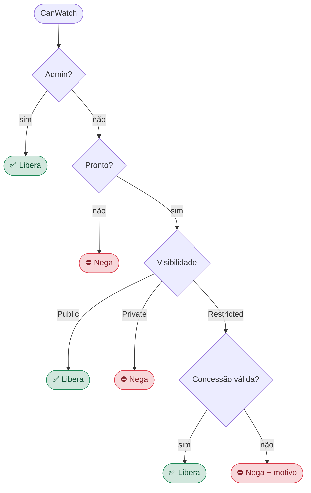
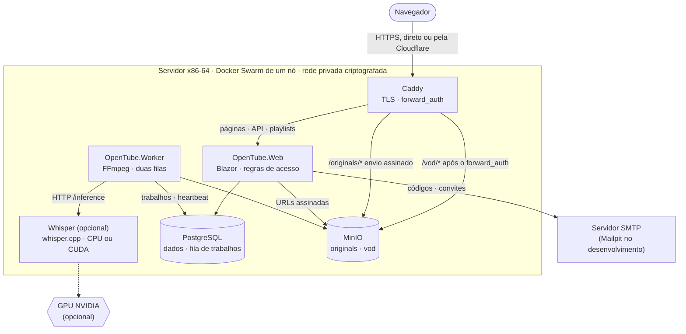
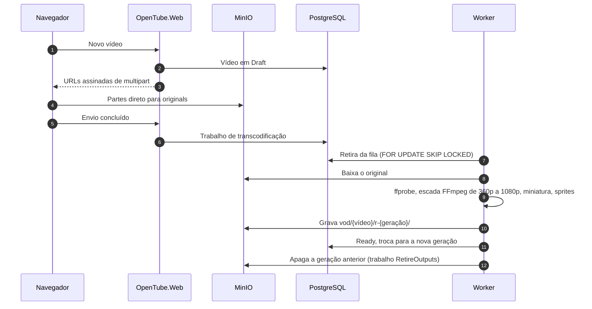
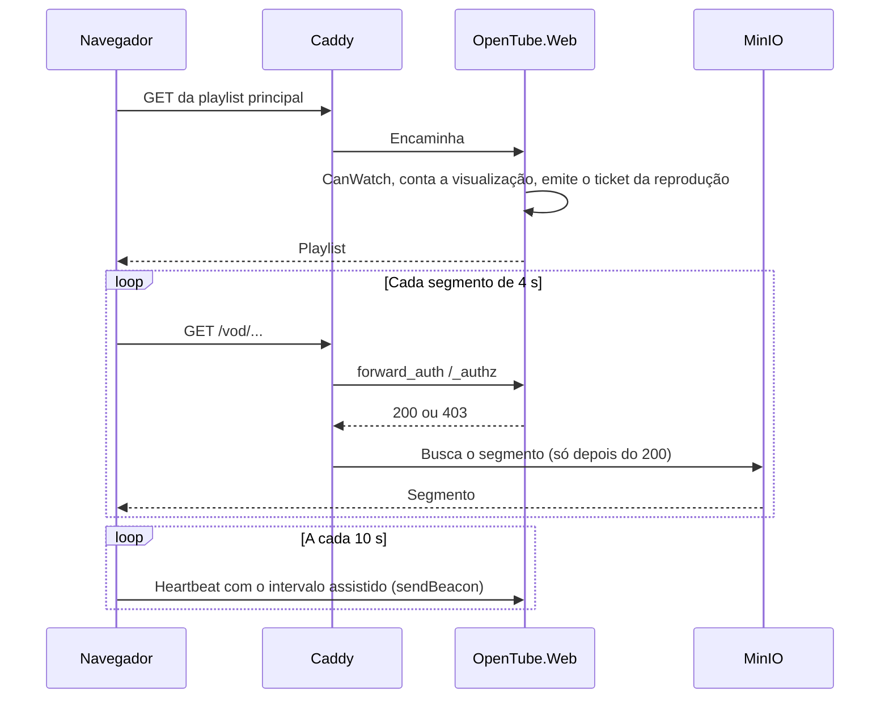
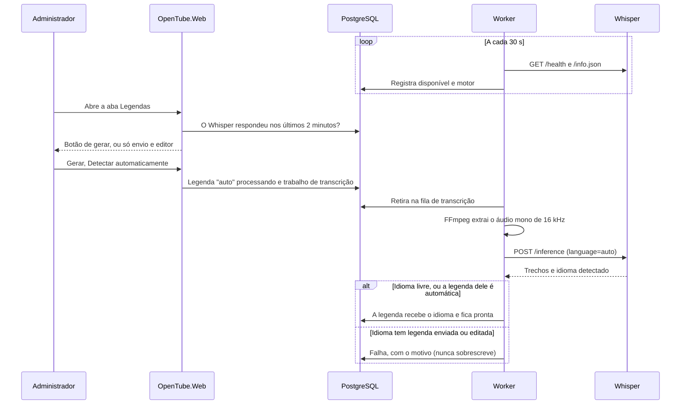

# OpenTube

[English](README.md) · **Português**

Plataforma de vídeo privada — um "YouTube interno" onde todo conteúdo nasce privado e o acesso é
concedido explicitamente: liberado para todos, direcionado a pessoas específicas ou a um domínio
de email inteiro, com validade opcional e registro detalhado de quem assistiu o quê.

---

## Índice

**Começar**

- [Requisitos do servidor](#requisitos-do-servidor)
- [Instalação em produção](#instalação-em-produção) — [antes de começar](#antes-de-começar) ·
  [instalar](#instalar) · [modos de acesso](#modos-de-acesso) · [o que é montado](#o-que-o-instalador-monta) ·
  [legendas automáticas](#legendas-automáticas-em-produção) · [operação](#operação) ·
  [desinstalar](#desinstalar)
- [Desenvolvimento](#desenvolvimento) — [pré-requisitos](#pré-requisitos) · [início rápido](#início-rápido) ·
  [`make watch`](#make-watch--hot-reload) · [`make up`](#make-up--pilha-inteira-em-container) ·
  [legendas](#legendas-automáticas-no-desenvolvimento) · [testes](#testes) · [alvos do make](#alvos-do-make)

**Como funciona**

- [Visão geral](#visão-geral)
- [Modelo de acesso](#modelo-de-acesso)
- [Arquitetura](#arquitetura)
- [Pipeline de vídeo](#pipeline-de-vídeo)
- [Analytics](#analytics)
- [Legendas](#legendas)
- [Capítulos](#capítulos)
- [Suporte por vídeo](#suporte-por-vídeo)

**Projeto**

- [Stack](#stack)
- [Estrutura do repositório](#estrutura-do-repositório)
- [Integração contínua e versões](#integração-contínua-e-versões)
- [Segurança e privacidade](#segurança-e-privacidade)
- [Roadmap](#roadmap)
- [Uso de IA no desenvolvimento](#uso-de-ia-no-desenvolvimento)
- [Créditos e atribuição](#créditos-e-atribuição)
- [Licença](#licença)

---

## Requisitos do servidor

Tudo roda numa única máquina (Docker Swarm de um nó): PostgreSQL, MinIO, a aplicação, o worker
(FFmpeg), o Caddy e — com as legendas automáticas ligadas — o Whisper. O que muda é quanto tempo
leva o trabalho pesado: transcodificar cada envio e transcrever a fala.

| | Mínima | Recomendada | Ideal |
| --- | --- | --- | --- |
| **Para** | Experimentar, acervo pequeno, poucos espectadores | Uso diário de uma equipe ou empresa, sem GPU | Acervo grande, envios frequentes, as melhores legendas |
| **CPU** | 2 vCPU (x86-64) | 8 vCPU com AVX2 (Intel Haswell / AMD Zen ou mais novos) | 8+ vCPU |
| **Memória** | 4 GB | 16 GB | 32 GB |
| **GPU** | — | — | NVIDIA com ≥ 6 GB de VRAM, Pascal ou mais nova (T4, L4, A10, RTX 3060+) |
| **Disco do sistema** | 40 GB SSD | 80 GB SSD NVMe | 100 GB SSD NVMe |
| **Storage dos vídeos** | Conforme o acervo (veja abaixo) | Disco ou volume separado | Disco ou volume separado, com backup |
| **Rede** | 100 Mbps | 1 Gbps | 1 Gbps ou mais |
| **Legendas automáticas** | Opcionais; `base-q5_1` (rápido, qualidade básica) | `small` na CPU | `large-v3-turbo-q5_0` na GPU, o mais preciso |
| **Imagem do Whisper** | `whisper:cpu` | `whisper:cpu` | `whisper:cuda` |

O container do Whisper lê a máquina ao subir e escolhe sozinho o modelo e as threads (tabela em
[Legendas automáticas em produção](#legendas-automáticas-em-produção)); nada precisa ser
configurado à mão. Na máquina mínima, deixar as legendas automáticas desligadas também é uma
escolha válida: as legendas continuam podendo ser enviadas ou escritas no editor.

**Sistema operacional:** Linux 64 bits recente, x86-64/amd64 (a arquitetura das imagens publicadas), com `apt` (Ubuntu 22.04/24.04 ou Debian 12). O
instalador instala o Docker, o UFW e — na máquina ideal — o NVIDIA Container Toolkit. A GPU precisa
do driver da NVIDIA já instalado (`nvidia-smi` funcionando no host).

**Storage dos vídeos.** Cada vídeo é guardado duas vezes: o original (para permitir reprocessar) e
as versões adaptativas. De um original 1080p, as versões somam cerca de 10,5 Mbit/s — **perto de
4,7 GB por hora de vídeo**, mais o original (em geral de 1 a 4 GB por hora). Reserve **de 6 a 9 GB
por hora de 1080p**; originais de resolução menor ocupam menos, porque a escada nunca passa da
resolução do original.

**O que cada faixa significa na prática** (números aproximados, variam com o conteúdo):

- **Transcodificação** usa só a CPU (FFmpeg, preset `veryfast`); a GPU não a acelera. Em 2 vCPU,
  uma hora de 1080p leva da ordem de uma hora ou mais; em 8 vCPU, uma fração disso.
- **Transcrição** corre numa fila própria, então nunca atrasa a transcodificação. Em 2 vCPU com
  `base-q5_1`, conte com algo perto do tempo real ou mais lento; em 8 vCPU com `small`, várias
  vezes mais rápido que o tempo real; na GPU com `large-v3-turbo`, uma hora de áudio em poucos
  minutos, com a melhor precisão.
- **Assistir** custa pouco ao servidor: os segmentos são arquivos estáticos que o Caddy entrega a
  partir do MinIO. O limite ali é a banda de saída — cada espectador em 1080p usa até uns 5 Mbit/s.

---

## Instalação em produção

Um comando num servidor x86-64 limpo sobe a plataforma inteira num Docker Swarm de um nó, usando
as imagens já publicadas no GHCR — nada é compilado no servidor.

### Antes de começar

- Um servidor que atenda aos [requisitos](#requisitos-do-servidor), com acesso de root por SSH.
- Um nome para ele: um domínio apontando para o servidor (modo público), um domínio com proxy da
  Cloudflare (modo Cloudflare) ou um nome que resolva na rede local.
- Uma conta SMTP para enviar os códigos de entrada. Dá para configurar depois, mas sem ela ninguém
  recebe código.
- Para transcrever na GPU: o driver da NVIDIA instalado no host (`nvidia-smi` funcionando). O
  instalador cuida do resto.

### Instalar

```bash
curl -fsSL https://gist.githubusercontent.com/allanbarcelos/be7a8e2ee36cfe0d0acfa123d4b4cd2a/raw/opentube-install.sh | sudo bash
```

O script vem do [gist de instalação](https://gist.github.com/allanbarcelos/be7a8e2ee36cfe0d0acfa123d4b4cd2a), mantido em sincronia com o `install.sh` a cada
push no `main` (ou rode `sudo bash install.sh` a partir de um checkout). As perguntas são feitas no
terminal mesmo quando o script chega pelo pipe:

| Pergunta | Observação |
| --- | --- |
| Nome da aplicação | Padrão `opentube`. Dá nome ao diretório `/opt/<nome>` e à pilha |
| Email do administrador | Entra com um código enviado por email — não há senha |
| Modo de acesso | Domínio público, rede local ou Cloudflare — veja [modos de acesso](#modos-de-acesso) |
| Domínio, porta, email do Let's Encrypt | Conforme o modo |
| SMTP | Servidor, porta, usuário e remetente; a senha vira segredo do Swarm |
| Legendas automáticas | Whisper ligado ou não; com GPU NVIDIA, se deve usá-la |
| Disco do MinIO | Onde ficam os arquivos de vídeo — pode ser um disco separado |

Depois de uma confirmação, ele segue sozinho e termina com um resumo. **Na primeira vez, o resumo
mostra a senha do banco e as chaves: copie e guarde** — elas só existem como segredos do Swarm, que
não podem ser lidos de volta.

Rodar o instalador de novo também é o jeito de mudar configurações (ligar o SMTP, trocar o modo de
acesso, ligar as legendas): as respostas anteriores voltam como padrão, e os segredos e o usuário
do banco que já existem são mantidos.

### Modos de acesso

| Modo | TLS | Portas expostas |
| --- | --- | --- |
| Domínio público | Caddy obtém certificado do Let's Encrypt | 80 e 443 |
| Rede local | Certificado interno | 80 e 443, só redes privadas |
| Cloudflare | A Cloudflare termina o HTTPS; a origem responde em HTTP | Uma porta (padrão 8080), só faixas da Cloudflare |

No modo Cloudflare, a porta da origem fica restrita às faixas da Cloudflare no UFW e no
`DOCKER-USER` (porta publicada pelo Docker não passa pelo UFW), com uma unidade systemd que
reaplica as regras depois que o Docker sobe. Um cron mensal atualiza as faixas. O Caddy só aceita
o `CF-Connecting-IP` em conexões vindas dessas faixas, então a aplicação vê o endereço real de
quem acessa. No painel da Cloudflare: registro DNS com proxy, SSL/TLS em Flexible, Always Use
HTTPS e uma Origin Rule quando a porta não é uma das que a Cloudflare repassa direto (80, 8080,
8880, 2052, 2082, 2086, 2095). Servir vídeo pela CDN da Cloudflare está sujeito aos termos do plano.

O Caddy é publicado em modo host: a malha de ingress do Swarm trocaria o endereço de quem acessa
por um interno, e os limites por origem passariam a valer para todo mundo de uma vez.

### O que o instalador monta

1. **Pacotes** — Docker, curl, OpenSSL, UFW e cron (e, com GPU, o NVIDIA Container Toolkit).
2. **Swarm** — um Docker Swarm de um nó.
3. **Credenciais** — usuário e senha do banco, chaves do storage e peppers, gerados no servidor e
   guardados só como segredos do Swarm. Nada disso vai para o disco nem para o repositório.
4. **Imagens** — `app`, `worker` e `whisper`, baixadas do GHCR. São públicas: não é preciso conta
   nem token do GitHub.
5. **Pilha** — PostgreSQL, MinIO, a aplicação, o worker, o Whisper e o Caddy, com `Production`
   como ambiente dentro dos containers.
6. **Firewall** — SSH mais o acesso web que o modo pede.
7. **Início** — espera os serviços subirem e imprime o resumo.

| Caminho | Conteúdo |
| --- | --- |
| `/opt/<nome>/docker-compose.prod.yml` | A pilha (só referências a segredos, nenhum valor) |
| `/opt/<nome>/etc/` | Caddyfile e `install.conf` (as respostas, sem segredos) |
| `/opt/<nome>/data/` | PostgreSQL, certificados do Caddy e modelos do Whisper |
| Disco do MinIO (escolhido) | Originais e vídeos publicados |
| `/opt/<nome>/scripts/update.sh` | Atualiza tudo para a versão mais recente (veja [operação](#operação)) |
| `/opt/<nome>/logs/` | Logs dos scripts de manutenção |

### Legendas automáticas em produção

O instalador pergunta se as legendas automáticas devem ser ligadas. Ligadas, o Whisper
([whisper.cpp](https://github.com/ggml-org/whisper.cpp)) roda como o serviço `whisper` da pilha, e
o worker fala com ele por HTTP dentro da rede privada.

- **GPU ou CPU.** O instalador procura uma GPU NVIDIA (`nvidia-smi`). Havendo, oferece a imagem
  `whisper:cuda`; como o Swarm não entrega GPU a um serviço diretamente, ele instala o NVIDIA
  Container Toolkit se preciso e, depois de perguntar (o Docker reinicia), torna o `nvidia` o
  runtime padrão do Docker. Sem GPU, ou sem o runtime, usa `whisper:cpu`. A imagem CUDA também
  cai para a CPU sozinha se a GPU sumir.
- **Otimizado para a máquina.** Ao subir, o container lê a memória da GPU, os núcleos e a memória
  que pode usar (inclusive os limites do Swarm) e escolhe:

  ```mermaid
  flowchart TD
      inicio(["Container sobe"]) --> gpu{"GPU NVIDIA respondendo<br/>dentro do container?"}
      gpu -->|"sim, ≥ 3 GB"| large["large-v3-turbo-q5_0 · 4 threads"]
      gpu -->|"sim, menos"| smallq["small-q5_1 · 4 threads"]
      gpu -->|não| simd{"CPU com AVX2?"}
      simd -->|não| base0["base-q5_1 · núcleos"]
      simd -->|sim| cpu{"Núcleos e memória<br/>(limites do cgroup)"}
      cpu -->|"≥ 8 e ≥ 4 GB"| small["small · até 8 threads"]
      cpu -->|"≥ 4 e ≥ 2 GB"| smallq2["small-q5_1 · núcleos"]
      cpu -->|menor| base["base-q5_1 · núcleos"]
      large & smallq & base0 & small & smallq2 & base --> tem{"Modelo já<br/>no volume?"}
      tem -->|não| baixa["Baixa e confere o SHA-256"]
      tem -->|sim| roda
      baixa --> roda(["whisper-server -l auto<br/>publica /info.json"])
  ```

  | Hardware | Modelo | Threads |
  | --- | --- | --- |
  | GPU NVIDIA com ≥ 3 GB | `large-v3-turbo-q5_0` (574 MB), o mais preciso | 4 |
  | GPU NVIDIA com menos | `small-q5_1` | 4 |
  | CPU **sem AVX2** (Celeron, Atom, Pentium Silver) | `base-q5_1` (60 MB) — o `small` levaria quase 4 minutos por minuto de fala | núcleos |
  | CPU com ≥ 8 núcleos e ≥ 4 GB | `small` (488 MB) | até 8 |
  | CPU com ≥ 4 núcleos e ≥ 2 GB | `small-q5_1` (190 MB) | núcleos |
  | menor que isso | `base-q5_1` (60 MB) | núcleos |

  A imagem de CPU traz código para várias gerações de processador x86-64 (de SSE a AVX2 e
  AVX-512) e carrega a melhor ao iniciar. A escolha aparece na aba Legendas e em
  `docker service logs <pilha>_whisper`.
- **Modelos sob demanda.** O modelo é baixado no primeiro início para `/opt/<nome>/data/whisper`,
  conferido pelo SHA-256 publicado, e fica lá. Todo modelo é multilíngue: reconhece e detecta os
  99 idiomas do Whisper, sem nada a baixar por idioma. Trocar de modelo baixa só o novo. Para
  forçar um modelo, rode o instalador com `WHISPER_MODEL=medium-q5_0` (lista em
  `docker/whisper/modelos.txt`).
- O botão de legenda aparece quando o modelo termina de carregar; até lá, e sempre que o container
  estiver fora do ar, a aba oferece só envio e editor.

As imagens são `ghcr.io/allanbarcelos/opentube/whisper:cpu` e `:cuda` (também
`cpu-v1.9.4`/`cuda-v1.9.4`, a versão do whisper.cpp), geradas pelo workflow `Whisper` quando
`docker/whisper/` muda. O `update.sh` baixa a que estiver em uso.

### Operação

A pilha leva o nome da aplicação (`opentube` por padrão; hífens viram sublinhados).

| Tarefa | Como |
| --- | --- |
| Atualizar para a versão mais recente | `sudo /opt/<nome>/scripts/update.sh` |
| Ver os serviços | `docker stack services <pilha>` |
| Acompanhar os logs de um serviço | `docker service logs -f <pilha>_app` (também `_worker`, `_whisper`, `_caddy`) |
| Mudar uma configuração | Rodar o instalador de novo |
| Backup | `/opt/<nome>/data` e o disco do MinIO, mais o resumo da primeira instalação |

**O que uma atualização faz.** O `update.sh` baixa o instalador mais recente e o roda com
`--update`: sem perguntas, com as respostas guardadas em `etc/install.conf` e os segredos que já
existem. Tudo sai como a versão nova descreve — imagens, arquivo da pilha, Caddy, regras de
firewall e o próprio `update.sh` —, então uma correção de infraestrutura chega do mesmo jeito que
uma correção de código. Nada que exija decisão acontece sozinho: instalar o toolkit da NVIDIA,
reiniciar o Docker ou ligar as legendas numa instalação que nunca as teve fica para uma execução
interativa. Um download cortado, ou que não seja o instalador, é recusado antes de rodar qualquer
coisa, e cada execução é acrescentada em `logs/update.log`.

Instalações anteriores a este `update.sh` só baixam imagens; para passá-las para o novo, rode uma
vez:

```bash
curl -fsSL https://gist.githubusercontent.com/allanbarcelos/be7a8e2ee36cfe0d0acfa123d4b4cd2a/raw/opentube-install.sh | sudo bash -s -- --update
```

### Desinstalar

```bash
curl -fsSL https://gist.githubusercontent.com/allanbarcelos/be7a8e2ee36cfe0d0acfa123d4b4cd2a/raw/opentube-uninstall.sh | sudo bash
```

Remove a pilha, os segredos do Swarm, as imagens locais, `/opt/<nome>` (**inclusive o banco**), o
disco do MinIO se ele estiver fora desse diretório e as regras de firewall do modo Cloudflare.
Docker, Swarm e outras pilhas ficam intactos. Ele pede confirmação, e não há como desfazer.

> **Sobre a imagem do MinIO:** as imagens públicas do MinIO deixaram de ser distribuídas pelo Docker
> Hub e pelo quay.io. O `docker-compose.yml` usa a última versão comunitária publicada, suficiente
> para desenvolvimento. Em produção, use o registro oficial com credenciais ou troque por qualquer
> outro servidor compatível com S3 (SeaweedFS, Garage, Amazon S3): a aplicação conversa apenas pela
> API S3, atrás da interface `IVideoStorage`.

---

## Desenvolvimento

O desenvolvimento local é feito pelo `make`; `make` sozinho lista os alvos. Não há usuário de
banco, senha nem chave no repositório: na primeira vez o `make` gera o `.env` (modo 600) e depois
o reutiliza.

### Pré-requisitos

| Ferramenta | Para quê |
| --- | --- |
| Docker (Docker Desktop ou Colima) | Dependências e testes de integração. O `make` inicia o Colima se ele estiver instalado e parado |
| .NET SDK 10 | A aplicação e o worker |
| FFmpeg | Transcodificação pelo worker no `make watch`; os testes que o usam são pulados sem ele |
| Homebrew (opcional) | `make whisper`, para ligar as legendas automáticas |

### Início rápido

```bash
git clone https://github.com/allanbarcelos/opentube.git
cd opentube
make watch
```

Abra http://localhost:5080 e entre com o email de administrador de
`src/OpenTube.Web/appsettings.Development.json`; o código chega no Mailpit, em
http://localhost:8025.

| Comando | O que sobe | Ambiente | Código |
| --- | --- | --- | --- |
| `make watch` | Banco, MinIO e Mailpit em container; aplicação e worker no host | `Development` | `dotnet watch`, recarrega ao salvar |
| `make up` / `make up-d` | Pilha inteira em container, com Caddy | `Development` | Imagem compilada, sem hot-reload |

### `make watch` — hot-reload

O modo do dia a dia. Só as dependências ficam em container; a aplicação e o worker rodam na
máquina, com `ASPNETCORE_ENVIRONMENT=Development`.

| Serviço | Endereço |
| --- | --- |
| Aplicação | http://localhost:5080 |
| Worker | processo local |
| MinIO (console) | http://localhost:9001 |
| Mailpit | http://localhost:8025 |
| PostgreSQL | `localhost:5432` |

O navegador envia o arquivo direto ao MinIO em `localhost:9000`. Usuário e senha estão no `.env`.
Ctrl+C encerra aplicação e worker; os containers continuam até `make deps-down`.
`make watch-web` e `make watch-worker` sobem cada processo sozinho, com as dependências já no ar.

### `make up` — pilha inteira em container

Tudo em container, também com `ASPNETCORE_ENVIRONMENT=Development`, mas sem recarregar quando o
código muda. Serve para ver a aplicação atrás do Caddy, com autorização por segmento, como em
produção.

```bash
make up-d
```

| Serviço | Endereço |
| --- | --- |
| Aplicação | https://localhost |
| Mailpit | http://localhost:8025 |
| Credenciais | `.env` |

O certificado de `localhost` é interno; o navegador avisa uma vez. Aqui o administrador é
`OPENTUBE_ADMIN_EMAIL` do `.env` (o gerador sugere `admin@localhost`). O Whisper fica de fora por
padrão, porque a compilação demora; para incluí-lo:
`docker compose --profile whisper up -d --build`.

Um volume criado com o usuário fixo antigo não aceita a senha nova: o PostgreSQL só aplica a senha
na primeira inicialização. `make clean` apaga esse volume para o banco nascer de novo.

### Legendas automáticas no desenvolvimento

`make whisper` instala o whisper.cpp (`whisper-cli`,
pelo Homebrew) e baixa um modelo para `.whisper/`, conferindo o SHA-256 publicado. A partir daí o
`make watch` liga a transcrição sozinho e avisa na abertura. O modelo padrão é o `small-q5_1`
(190 MB), bom para português e rápido no Apple Silicon (Metal); dá para escolher outro com
`make whisper m=base` (mais rápido) ou `m=large-v3-turbo-q5_0` (o mais preciso). Reinicie o
`make watch` depois de instalar. O idioma é detectado do mesmo jeito que em produção.

### Testes

```bash
make test            # todas as suítes
make test p=Web      # um projeto: Domain, Infrastructure, Worker ou Web
```

Os testes de integração sobem PostgreSQL e MinIO próprios (Testcontainers): precisam do Docker,
mas não do `.env` nem das dependências do `make watch`. Os que usam FFmpeg são pulados quando ele
não está instalado, e os que transcrevem fala de verdade são pulados sem o Whisper (`make whisper`)
e o `say` do macOS. `OPENTUBE_WHISPER_URL=http://…` os aponta para um servidor do Whisper já no ar —
o container da imagem, por exemplo. Compilam em `.artifacts/test`, e não no `bin`/`obj` dos projetos, para poderem
rodar enquanto o `make watch` recompila os mesmos projetos.

Cada fase do roadmap só é considerada concluída com sua suíte verde. A lógica sensível vive em
classes puras (regras de acesso, fusão de intervalos, cálculo do ladder de transcodificação,
limitador de taxa), testável sem banco nem rede; o restante usa containers efêmeros.

### Alvos do make

| Alvo | O que faz |
| --- | --- |
| `make watch` | Dependências em container, aplicação e worker no host com hot-reload |
| `make watch-web` / `make watch-worker` | Só a aplicação, ou só o worker (dependências já no ar) |
| `make deps-up` / `make deps-down` | Sobe ou para só o banco, o MinIO e o Mailpit |
| `make whisper` | Instala o whisper.cpp e um modelo para as legendas (`m=base`, `m=large-v3-turbo-q5_0`…) |
| `make up` / `make up-d` | Compila e sobe a pilha inteira (em primeiro plano / em segundo plano) |
| `make down` | Para e remove os containers |
| `make restart s=app` | Reinicia um serviço sem recompilar |
| `make logs` / `make logs s=app` | Acompanha os logs de todos os serviços ou de um |
| `make ps` | Lista os containers e a situação deles |
| `make build` | Recompila as imagens sem subir |
| `make shell s=app` | Abre um shell num container em execução |
| `make test` / `make test p=Web` | Roda todas as suítes, ou uma (`Domain`, `Infrastructure`, `Worker`, `Web`) |
| `make clean` | Remove containers, volumes e órfãos — reset completo |

---

## Visão geral

| Recurso | Descrição |
| --- | --- |
| Home | Lista de vídeos visíveis para quem está acessando, com busca |
| Envio | Vários vídeos de uma vez, ou uma pasta inteira que vira coleção; direto do navegador para o storage, sem passar pelo servidor da aplicação |
| Visibilidade | Todo vídeo nasce **privado**; o administrador promove para público ou restrito |
| Convites | Email com link de acesso e código de 6 dígitos — sem senha |
| Domínios | Porta de entrada própria por domínio verificado por DNS |
| Validade | Acesso eterno, até uma data ou por um período após o primeiro uso |
| Analytics | Quem assistiu, quando, de onde, em qual dispositivo e quanto de cada vídeo |
| Suporte | Comentários privados por vídeo, visíveis apenas ao autor e ao administrador |
| Coleções | Vídeos agrupados em coleções; o acesso pode ser dado por vídeo, por coleção ou ao acervo inteiro |
| Utilidade | Quem assiste avalia de 1 a 5 o quanto o vídeo foi útil; só a administração vê as notas |
| Capítulos | Sumário montado nas configurações do vídeo, mostrado ao lado dele e numa barra de capítulos sob o player |
| Legendas | Aba por idioma: automáticas com o Whisper (idioma detectado sozinho), envio de arquivo e editor no próprio sistema |
| Proteção | Marca d'água móvel com o email de quem assiste, marca d'água do acervo em PNG, sem download nem transmissão, limite de reproduções simultâneas |
| Auditoria | Toda ação administrativa fica registrada: concessão, revogação, publicação, exclusão |
| Idiomas | Interface em inglês, português e francês |

A interface é em inglês, português e francês. O inglês é a base: é o que aparece quando o
navegador não pede outro idioma e quando falta uma tradução. O menu troca o idioma e guarda a
escolha num cookie.

---

## Modelo de acesso

### Visibilidade do vídeo

| Estado | Quem vê |
| --- | --- |
| `Private` | Somente administradores. É o padrão de todo upload. |
| `Public` | Qualquer visitante do site, sem autenticação. |
| `Restricted` | Somente quem possui uma concessão de acesso válida. |

### Concessões (`AccessGrant`)

Os quatro tipos de acesso são a mesma entidade com sujeitos diferentes:

| Sujeito | Significado |
| --- | --- |
| `User` | Um email específico (`allan@barcelos.dev`) |
| `Domain` | Qualquer email de um domínio verificado (`barcelos.dev`) |
| `Link` | Quem possuir um token secreto de compartilhamento |
| `Public` | Qualquer visitante |

Cada concessão aponta para um **vídeo**, uma **coleção** ou **todo o acervo**, e carrega janela de
validade (`starts_at` / `expires_at`, nulo = eterno), limite opcional de visualizações, permissão de
download e registro de revogação.

O limite de visualizações é contado na playlist principal, com um incremento condicional no
banco que não deixa reproduções simultâneas passarem do teto. Ao contar a visualização, a
aplicação emite um bilhete assinado (cookie por vídeo, válido pela duração mais uma folga) que
deixa o restante daquela reprodução — versões, segmentos, legendas — passar mesmo quando ela
consumiu a última visualização. O bilhete não abre reprodução nova e não sobrevive à revogação.

A decisão fica concentrada numa única função `CanWatch(viewer, video)` — toda a aplicação (home,
busca, player, legenda, thumbnail, download) passa por ela. É o ponto do sistema com maior cobertura
de testes, porque um erro ali vaza conteúdo confidencial.



- **Pronto** — processado e não excluído.
- **Concessão válida** — alcança quem assiste (email, domínio, link ou pública), cobre o vídeo
  (direto, por coleção ou o acervo inteiro) e está ativa (dentro do período, abaixo do limite de
  visualizações, não revogada).
- **Motivo** — o mais próximo: "seu acesso expirou" ajuda mais que um "não encontrado" genérico.

### Autenticação sem senha

Nenhuma senha é gerada, trafegada ou armazenada. O convite traz um **link de uso único** e um
**código de 6 dígitos** (para quando o cliente de email quebra o link). Ambos ficam no banco apenas
como hash, expiram em 15 minutos (código) e 7 dias (convite), e o primeiro uso cria uma sessão em
cookie de 30 dias, renovável e revogável de imediato pelo administrador.

### Acesso por domínio

1. O administrador cadastra `barcelos.dev` e recebe um token de verificação.
2. O responsável pelo domínio publica `TXT _opentube-verify.barcelos.dev = <token>`.
3. Verificado o registro, o sistema libera a porta de entrada `/entry/barcelos.dev`.
4. Quem chega nessa página informa um email do domínio e recebe o código por email.

A verificação por DNS existe para impedir que alguém cadastre um domínio que não controla. O envio
e a validação de códigos são limitados por taxa (IP, email e domínio), única barreira contra força
bruta num código de 6 dígitos.

---

## Arquitetura



O envio do arquivo vai **direto do navegador para o MinIO** via URLs assinadas de multipart, sem
passar pela aplicação. Em produção o envio passa pelo Caddy, no caminho `/originals`. O worker é
o único componente que escala por CPU e por isso vive em container separado desde o primeiro dia;
ele roda duas filas, para que uma transcrição longa nunca segure uma transcodificação. Tudo
conversa pela rede overlay privada da pilha; só o Caddy publica porta. O Whisper, das legendas automáticas, também roda em container
próprio, e é opcional (veja [Legendas automáticas em produção](#legendas-automáticas-em-produção)).

---

## Pipeline de vídeo

1. **Envio** — a aplicação cria o registro do vídeo em `Draft` e devolve URLs assinadas; o navegador
   envia os pedaços direto ao bucket `originals`; ao concluir, enfileira o job de transcodificação.
   Dá para escolher vários arquivos de uma vez, ou em várias rodadas (cada escolha acrescenta à
   lista), e o título de cada vídeo começa como o nome do arquivo sem a extensão (editável antes
   de enviar); a descrição é preenchida depois, nas configurações do vídeo. Escolher uma pasta cria uma coleção com o
   nome dela, e cada vídeo da pasta (inclusive de subpastas) entra na coleção quando termina de
   subir; o que não é vídeo fica de fora. Os arquivos sobem um de cada vez, e um que falhou pode ser
   enviado de novo sem reenviar os outros.
2. **Análise** — `ffprobe` extrai duração, resolução e codecs, e rejeita arquivo inválido cedo.
3. **Transcodificação** — FFmpeg gera um ladder adaptativo (360p a 1080p, nunca acima da resolução
   original) em CMAF/fMP4, segmentos de 4 s com keyframes alinhados entre as versões.
4. **Derivados** — thumbnail e folha de sprites para prévia na barra de progresso. As legendas
   são pedidas à parte, por idioma (veja [Legendas](#legendas)).
5. **Publicação** — estado `Ready`, vídeo disponível conforme sua visibilidade.



O original é preservado no bucket `originals` para permitir reprocessamento. Cada processamento
grava numa pasta nova (`<vídeo>/r-<geração>/`) e só troca a versão em uso quando tudo foi
enviado: reprocessar não tira o vídeo do ar, uma falha no meio mantém a versão anterior, e as
gerações antigas são apagadas depois da troca. As legendas ficam fora das gerações. Um trabalho
interrompido (worker reiniciado no meio) é retomado na tentativa seguinte.

### Entrega autorizada

A playlist HLS é servida por um endpoint da aplicação, que valida o acesso. No `make watch` o
manifesto sai com URLs assinadas de curta duração, porque o navegador fala direto com o MinIO.
Na pilha local (`make up`) e na produção, o Caddy autoriza cada segmento com `forward_auth`: a
aplicação decide, ele transporta os bytes. Revogar um acesso vale no segmento seguinte, em vez
de esperar a assinatura vencer. O original continua indo por URL assinada, no caminho `/originals`.



Sobre proteção de conteúdo, sem rodeios: sem DRM, quem tem acesso legítimo consegue baixar. O que
funciona na prática é token curto, limite de sessões simultâneas por usuário, marca d'água dinâmica
com o email de quem assiste e registro completo de acesso. O empacotamento em CMAF mantém a porta
aberta para adicionar DRM depois sem reescrever nada.

O que o player faz contra a cópia casual:

- Sem download ou transmissão (AirPlay, Chromecast) nos controles nativos, e sem menu de contexto
  ou arrasto sobre o vídeo. Tela cheia e Picture-in-Picture continuam disponíveis.
- Marca d'água em duas camadas: um mosaico fraco e inclinado sobre o quadro inteiro, que não sai
  num recorte, e uma etiqueta legível com email, data e hora que muda de canto. Quem entrou por
  link secreto recebe o começo do identificador da concessão.
- O botão de tela cheia do player (e o duplo clique) coloca o contêiner em tela cheia, com a marca
  por cima. Na tela cheia do próprio vídeo (controle nativo do Safari e do Firefox, iPhone) e no
  Picture-in-Picture o navegador desenha só o vídeo, então a marca vai como legenda, exibida só
  nesses modos e religada se alguém a desligar. O Picture-in-Picture do Chromium não desenha
  legendas: ali a janela fica sem marca.
- Marca do acervo: uma imagem PNG (até 5 MB) definida em Administração → Marca d'água, exibida
  sobre todos os vídeos na posição escolhida (um canto ou o centro), na página e na tela cheia
  do player. O arquivo é conferido como PNG de verdade pela assinatura, não pelo nome. O servidor
  a leva ao tamanho padrão — cabe em 640 × 320 pixels, mantendo a proporção — com redução em
  etapas de alta qualidade, que preserva a transparência e as bordas; o que fica guardado e é
  servido é essa versão, sem os metadados do original. Imagens menores não são ampliadas, e o
  lado maior precisa ter pelo menos 160 pixels. A
  etiqueta de identificação não passa por esse canto. Na tela cheia nativa e no
  Picture-in-Picture o navegador desenha só o vídeo, então a imagem não aparece ali; o email de
  quem assiste continua, como legenda.

---

## Analytics

O player envia um heartbeat a cada 10 segundos com o intervalo assistido desde o anterior, usando
`sendBeacon` para sobreviver ao fechamento da aba. Guardar **intervalos** em vez de porcentagem é o
que permite responder "ele pulou esse trecho?" e desenhar a curva de retenção segundo a segundo.

Um job periódico funde os intervalos por sessão (união de faixas, sem contar re-exibição duas vezes)
e agrega em tabelas diárias, mantendo o painel instantâneo mesmo com milhões de eventos.

**Utilidade.** Quem entrou com email responde "Este vídeo foi útil?" de 1 a 5, embaixo do vídeo;
a nota é enviada sem recarregar a página, então o vídeo continua tocando, e pode ser trocada. Cada
pessoa vê só a própria nota; a média, o total e a distribuição aparecem apenas para a
administração, na página do vídeo.

**Painéis:** por vídeo (retenção, conclusão, dispositivos, erros), por usuário (linha do tempo
completa), por domínio e por convite — este último respondendo "convidei 12, 7 abriram, 5
assistiram, 2 terminaram", que costuma ser a métrica que interessa de verdade. Exportação em CSV.

---

## Legendas

A aba **Legendas** de cada vídeo, ao lado de Configuração e Audiência, lista uma legenda por idioma
com a situação (pronta, processando, falhou) e a origem (enviada, automática, editada).

- **Geração automática** com o Whisper, em segundo plano, **só quando o Whisper está disponível**.
  O padrão é *Detectar automaticamente*: o Whisper descobre o idioma falado e a legenda o recebe
  ao terminar (também dá para escolher o idioma à mão). Se esse idioma já tem uma legenda
  automática, ela é atualizada; uma enviada ou corrigida à mão nunca é sobrescrita — o pedido
  falha dizendo isso. A legenda fica *processando* até terminar, e a página se atualiza sozinha.
  Um idioma em processamento não pode ser pedido de novo — nem por dois pedidos no mesmo instante,
  que o índice único do banco resolve. Envio e edição desse idioma também esperam, porque o
  resultado os sobrescreveria. A falha só é registrada depois da última tentativa, com o motivo.
- **Envio** de WebVTT ou SRT; tudo é guardado como WebVTT, normalizado e ordenado.
- **Escrever uma legenda**: cria uma legenda vazia num idioma e a abre no editor.
- **Download** do arquivo, com o nome do vídeo e do idioma, para corrigir fora do sistema.
- **Editor** no próprio webapp, no estilo de um editor de código: a primeira coluna numera as
  linhas, a segunda tem o tempo em que a legenda entra (e sai), a terceira o texto. Ao lado, o
  vídeo: o trecho em exibição fica destacado e o texto aparece sobre ele enquanto se digita;
  botões e atalhos marcam início ou fim no tempo do vídeo, inserem e removem trechos e salvam
  (⌘/Ctrl+S). Tempos e texto são conferidos no navegador e de novo no servidor.

O texto da legenda mais recente alimenta a busca.

**Disponibilidade.** A cada 30 s o worker confere o Whisper e registra a resposta no banco. A aba
Legendas só mostra a geração automática (e os botões *Gerar de novo*) enquanto algum worker tiver
informado o Whisper respondendo nos últimos dois minutos, junto com o que ele usa (por exemplo
`whisper.cpp · CUDA · large-v3-turbo-q5_0`). Sem ele, a aba oferece envio e editor, e um pedido
direto ao endpoint é recusado. As transcrições correm numa fila própria do worker: uma longa nunca
segura a transcodificação de um vídeo recém-enviado.



---

## Capítulos

A administração monta o sumário de cada vídeo nas configurações dele: linhas de início (`0:00`,
`5:10`, `1:05:10`) e título, acrescentadas e removidas na própria página; a ordem é acertada pelo
tempo ao salvar, e nenhum capítulo começa depois do fim do vídeo. Cada capítulo vai do seu início
até o início do próximo.

Quem assiste vê o sumário ao lado do vídeo, com o capítulo atual destacado conforme ele toca, e uma
barra de capítulos logo abaixo do player — um segmento por capítulo, do tamanho da duração dele,
que se enche conforme o vídeo avança. Clicar num capítulo, ou num ponto da barra, leva o player até
lá. O player mantém os controles nativos do navegador, que não aceitam marcas na própria barra de
progresso; por isso a barra de capítulos fica logo abaixo.

---

## Suporte por vídeo

Os comentários funcionam como atendimento: cada conversa pertence a um par (vídeo, usuário) e é
visível apenas ao autor e aos administradores. Tem status (`aberto`, `respondido`, `fechado`) e
notificação por email nos dois sentidos. Um tempo escrito na mensagem — `1:05:10`, `5:10` — vira
link, como no YouTube: na página do vídeo leva o player àquele instante sem recarregar, e na
administração abre o vídeo naquele ponto (`?t=` no endereço). Só conta o tempo que cabe no vídeo:
"às 14:30" num vídeo de 10 minutos continua texto.

---

## Stack

| Camada | Tecnologia |
| --- | --- |
| Aplicação | .NET 10, Blazor Web App (SSR + `InteractiveServer` na área administrativa) |
| Interface | Bootstrap 5.3 com a paleta padrão |
| Banco | PostgreSQL 17, EF Core para o domínio e Dapper para agregações |
| Storage | MinIO (API S3), buckets `originals` e `vod` |
| Mídia | FFmpeg em worker próprio, HLS/CMAF, player `hls.js` |
| Fila | Tabela de jobs no PostgreSQL com `FOR UPDATE SKIP LOCKED` |
| Email | Abstração `IEmailSender`; Mailpit em desenvolvimento |
| Busca | `tsvector` com dicionário português e `pg_trgm` |
| Proxy | Caddy com TLS automático |
| Legendas | whisper.cpp em container próprio (CPU ou CUDA), WebVTT |
| Implantação | Docker Swarm, imagens no GHCR, GitHub Actions |

---

## Estrutura do repositório

```
Makefile                      alvos locais (não existe `make dev`)
install.sh / uninstall.sh     produção em Docker Swarm
docker-compose.yml            pilha inteira em container
docker-compose.dev.yml        publica as portas das dependências no host
Caddyfile
scripts/                      geração do .env, ambiente do `dotnet watch`, entrypoint do Swarm, Whisper do dev
docker/whisper/               imagem do servidor do Whisper (cpu e cuda), detecção de hardware, tabela de modelos
src/
  OpenTube.Shared/            contratos e DTOs compartilhados
  OpenTube.Domain/            entidades e regras de acesso (sem dependência de infraestrutura)
  OpenTube.Infrastructure/    EF Core, storage S3, email, verificação DNS, fila
  OpenTube.Web/               Blazor: home, busca, player e área administrativa
  OpenTube.Worker/            transcodificação, derivados e agregação de analytics
tests/
  OpenTube.Domain.Tests/
  OpenTube.Infrastructure.Tests/
  OpenTube.Worker.Tests/
  OpenTube.Web.Tests/
  OpenTube.TestSupport/
```

---

## Integração contínua e versões

Cada imagem tem o seu workflow, e um push no `main` roda só o que a mudança exige:

| Workflow | Imagem | Testes | Tags |
| --- | --- | --- | --- |
| `app.yml` | `ghcr.io/allanbarcelos/opentube/app` | Domain, Infrastructure, Web | `latest`, SHA do commit, `app-vA.B.C.D` |
| `worker.yml` | `ghcr.io/allanbarcelos/opentube/worker` | Worker | `latest`, SHA do commit, `worker-vA.B.C.D` |
| `whisper.yml` | `ghcr.io/allanbarcelos/opentube/whisper` | ShellCheck, teste de fumaça | `cpu`, `cuda`, `cpu-v1.9.4`, `cuda-v1.9.4` |
| `gist.yml` | — | — | Publica o `install.sh` e o `uninstall.sh` no gist |
| `headers.yml` | — | Cabeçalhos de licença | Recusa arquivo de código sem o cabeçalho SPDX (corrija com `make headers`) |

Os testes rodam quando muda código que eles compilam, mas uma imagem só é compilada e publicada
quando algo que vai para dentro dela mudou desde o push anterior: README, teste, instalador ou o
próprio workflow não disparam build, e uma mudança só na web não recompila o worker (nem o
contrário). Código compartilhado pelos dois (Domain, Infrastructure, Shared, os
`Directory.*.props`) recompila os dois. Quem decide é o `.github/scripts/changed.sh`, e o resumo do
job diz por que o build rodou ou foi pulado.

Cada imagem de `app` ou `worker` publicada recebe a próxima versão `A.B.C.D` e uma GitHub Release
com a lista dos commits que entraram nela. O job do gist precisa do segredo `GIST_TOKEN`, com o
escopo `gist`, e da variável de repositório `GIST_ID`; a primeira execução sem `GIST_ID` cria o
gist e imprime o id para ser salvo.

---

## Segurança e privacidade

Para relatar uma vulnerabilidade, veja o [SECURITY.md](SECURITY.md) — de forma privada, nunca numa issue pública.

- Nenhuma senha é gerada ou enviada por email.
- Códigos e tokens ficam apenas como hash, com uso único e expiração curta.
- Limite de taxa no envio e na validação de códigos, com bloqueio progressivo. Cada tentativa de
  código é reservada no banco antes da comparação, então pedidos em paralelo não passam do
  limite, e um código ou link só abre uma sessão.
- Atrás do Caddy, o endereço e o protocolo reais vêm de `X-Forwarded-For` e `X-Forwarded-Proto`,
  aceitos só de redes privadas (ajustável em `ReverseProxy:TrustedNetworks`). Sem isso, os
  limites por origem valeriam para o site inteiro e os cookies sairiam sem a marca de conexão segura.
- Coleta de audiência limitada por origem e por tamanho de lote.
- IP registrado como hash com segredo rotativo; guarda-se o país, não o endereço.
- Eventos brutos de reprodução retidos por 24 meses; agregados permanecem.
- Exclusão de usuário anonimiza os eventos em vez de apagá-los.
- Registro de auditoria de toda ação administrativa: conceder, revogar, publicar, excluir.
- Aviso explícito ao convidado, no primeiro acesso, de que a visualização é registrada.

---

## Roadmap

| Fase | Escopo | Estado |
| --- | --- | --- |
| 1 | Núcleo: upload, transcodificação, player, home e busca | **concluída** |
| 2 | Acesso: concessões, convites e coleções | **concluída** |
| 3 | Domínios: verificação por DNS e porta de entrada dedicada | **concluída** |
| 4 | Analytics: coleta, agregação, painéis e exportação | **concluída** |
| 5 | Suporte: conversas privadas por vídeo | **concluída** |
| 6 | Refino: legendas automáticas, marca d'água, auditoria, autorização por segmento | **concluída** |
| 7 | Produção: instalador no Swarm (modo Cloudflare), imagens no GHCR, proteção do player, marca d'água do acervo, interface em três idiomas | **concluída** |
| 8 | Legendas: aba por idioma, editor, container dedicado do Whisper com detecção de GPU/CPU e do idioma falado | **concluída** |

---

## Uso de IA no desenvolvimento

Ferramentas de IA foram usadas apenas para gerar os READMEs e demais textos, para o início dos
testes unitários e para análise de segurança. Todo o código foi revisado e/ou feito por humano.

---

## Créditos e atribuição

Todo arquivo de código começa com um cabeçalho SPDX que informa a licença e o autor:

```
SPDX-License-Identifier: MIT
Copyright (c) 2026 Allan Barcelos. OpenTube: https://github.com/allanbarcelos/opentube
```

A licença MIT exige que esse aviso seja mantido em qualquer cópia ou parte relevante do código;
apagá-lo de arquivos copiados descumpre a licença. O `make headers` o acrescenta em arquivos
novos, e o CI recusa uma mudança que traga arquivo sem ele. Código de terceiros (Bootstrap,
hls.js) mantém os próprios avisos.

Se você usa, faz um fork ou constrói sobre o OpenTube, mantenha também o link **Feito com
OpenTube** no rodapé e cite o projeto original com um link. A licença não obriga, mas é assim que
um projeto livre fica conhecido — veja o [NOTICE](NOTICE).

---

## Licença

[MIT](LICENSE) © 2026 Allan Barcelos.
