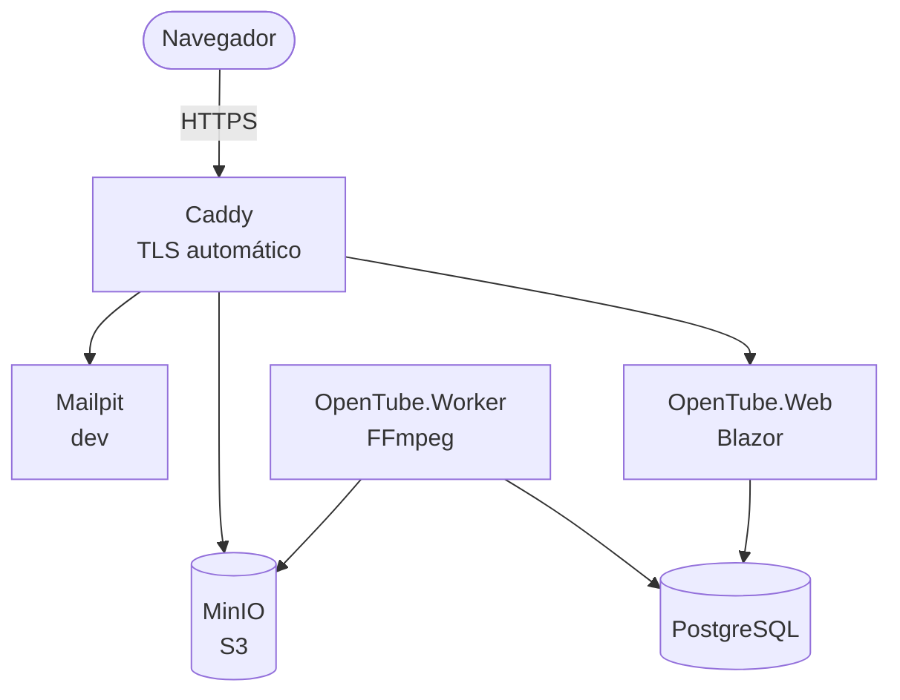

# OpenTube

[English](README.md) · **Português**

Plataforma de vídeo privada — um "YouTube interno" onde todo conteúdo nasce privado e o acesso é
concedido explicitamente: liberado para todos, direcionado a pessoas específicas ou a um domínio
de email inteiro, com validade opcional e registro detalhado de quem assistiu o quê.

---

## Índice

- [Visão geral](#visão-geral)
- [Modelo de acesso](#modelo-de-acesso)
- [Arquitetura](#arquitetura)
- [Pipeline de vídeo](#pipeline-de-vídeo)
- [Analytics](#analytics)
- [Suporte por vídeo](#suporte-por-vídeo)
- [Stack](#stack)
- [Estrutura do repositório](#estrutura-do-repositório)
- [Como rodar](#como-rodar)
- [Testes](#testes)
- [Segurança e privacidade](#segurança-e-privacidade)
- [Roadmap](#roadmap)

---

## Visão geral

| Recurso | Descrição |
| --- | --- |
| Home | Lista de vídeos visíveis para quem está acessando, com busca |
| Upload | Envio direto do navegador para o storage, sem passar pelo servidor da aplicação |
| Visibilidade | Todo vídeo nasce **privado**; o administrador promove para público ou restrito |
| Convites | Email com link de acesso e código de 6 dígitos — sem senha |
| Domínios | Porta de entrada própria por domínio verificado por DNS |
| Validade | Acesso eterno, até uma data ou por um período após o primeiro uso |
| Analytics | Quem assistiu, quando, de onde, em qual dispositivo e quanto de cada vídeo |
| Suporte | Comentários privados por vídeo, visíveis apenas ao autor e ao administrador |

---

## Modelo de acesso

### Visibilidade do vídeo

| Estado | Quem vê |
| --- | --- |
| `Private` | Somente administradores. É o padrão de todo upload. |
| `Public` | Qualquer visitante do site, sem autenticação. |
| `Restricted` | Somente quem possui uma concessão de acesso válida. |

### Concessões (`AccessGrant`)

Os quatro tipos de acesso são a mesma entidade com sujeitos diferentes:

| Sujeito | Significado |
| --- | --- |
| `User` | Um email específico (`allan@barcelos.dev`) |
| `Domain` | Qualquer email de um domínio verificado (`barcelos.dev`) |
| `Link` | Quem possuir um token secreto de compartilhamento |
| `Public` | Qualquer visitante |

Cada concessão aponta para um **vídeo**, uma **coleção** ou **todo o acervo**, e carrega janela de
validade (`starts_at` / `expires_at`, nulo = eterno), limite opcional de visualizações, permissão de
download e registro de revogação.

O limite de visualizações é contado na playlist principal, com um incremento condicional no
banco que não deixa reproduções simultâneas passarem do teto. Ao contar a visualização, a
aplicação emite um bilhete assinado (cookie por vídeo, válido pela duração mais uma folga) que
deixa o restante daquela reprodução — versões, segmentos, legendas — passar mesmo quando ela
consumiu a última visualização. O bilhete não abre reprodução nova e não sobrevive à revogação.

A decisão fica concentrada numa única função `CanWatch(viewer, video)` — toda a aplicação (home,
busca, player, legenda, thumbnail, download) passa por ela. É o ponto do sistema com maior cobertura
de testes, porque um erro ali vaza conteúdo confidencial.

### Autenticação sem senha

Nenhuma senha é gerada, trafegada ou armazenada. O convite traz um **link de uso único** e um
**código de 6 dígitos** (para quando o cliente de email quebra o link). Ambos ficam no banco apenas
como hash, expiram em 15 minutos (código) e 7 dias (convite), e o primeiro uso cria uma sessão em
cookie de 30 dias, renovável e revogável de imediato pelo administrador.

### Acesso por domínio

1. O administrador cadastra `barcelos.dev` e recebe um token de verificação.
2. O responsável pelo domínio publica `TXT _opentube-verify.barcelos.dev = <token>`.
3. Verificado o registro, o sistema libera a porta de entrada `/entry/barcelos.dev`.
4. Quem chega nessa página informa um email do domínio e recebe o código por email.

A verificação por DNS existe para impedir que alguém cadastre um domínio que não controla. O envio
e a validação de códigos são limitados por taxa (IP, email e domínio), única barreira contra força
bruta num código de 6 dígitos.

---

## Arquitetura



O envio do arquivo vai **direto do navegador para o MinIO** via URLs assinadas de multipart, sem
passar pela aplicação. O worker é o único componente que escala por CPU e por isso vive em container
separado desde o primeiro dia.

---

## Pipeline de vídeo

1. **Upload** — a aplicação cria o registro do vídeo em `Draft` e devolve URLs assinadas; o navegador
   envia os pedaços direto ao bucket `originals`; ao concluir, enfileira o job de transcodificação.
2. **Análise** — `ffprobe` extrai duração, resolução e codecs, e rejeita arquivo inválido cedo.
3. **Transcodificação** — FFmpeg gera um ladder adaptativo (360p a 1080p, nunca acima da resolução
   original) em CMAF/fMP4, segmentos de 4 s com keyframes alinhados entre as versões.
4. **Derivados** — thumbnail, folha de sprites para prévia na barra de progresso e, se um
   transcritor estiver configurado, legenda automática. Sem executável, essa etapa fica desligada.
5. **Publicação** — estado `Ready`, vídeo disponível conforme sua visibilidade.

O original é preservado no bucket `originals` para permitir reprocessamento. Cada processamento
grava numa pasta nova (`<vídeo>/r-<geração>/`) e só troca a versão em uso quando tudo foi
enviado: reprocessar não tira o vídeo do ar, uma falha no meio mantém a versão anterior, e as
gerações antigas são apagadas depois da troca. As legendas ficam fora das gerações. Um trabalho
interrompido (worker reiniciado no meio) é retomado na tentativa seguinte.

### Entrega autorizada

A playlist HLS é servida por um endpoint da aplicação, que valida o acesso. No `make watch` o
manifesto sai com URLs assinadas de curta duração, porque o navegador fala direto com o MinIO.
Na pilha local (`make up`) e na produção, o Caddy autoriza cada segmento com `forward_auth`: a
aplicação decide, ele transporta os bytes. Revogar um acesso vale no segmento seguinte, em vez
de esperar a assinatura vencer. O original continua indo por URL assinada, no caminho `/originals`.

Sobre proteção de conteúdo, sem rodeios: sem DRM, quem tem acesso legítimo consegue baixar. O que
funciona na prática é token curto, limite de sessões simultâneas por usuário, marca d'água dinâmica
com o email de quem assiste e registro completo de acesso. O empacotamento em CMAF mantém a porta
aberta para adicionar DRM depois sem reescrever nada.

O que o player faz contra a cópia casual:

- Sem download ou transmissão (AirPlay, Chromecast) nos controles nativos, e sem menu de contexto
  ou arrasto sobre o vídeo. Tela cheia e Picture-in-Picture continuam disponíveis.
- Marca d'água em duas camadas: um mosaico fraco e inclinado sobre o quadro inteiro, que não sai
  num recorte, e uma etiqueta legível com email, data e hora que muda de canto. Quem entrou por
  link secreto recebe o começo do identificador da concessão.
- O botão de tela cheia do player (e o duplo clique) coloca o contêiner em tela cheia, com a marca
  por cima. Na tela cheia do próprio vídeo (controle nativo do Safari e do Firefox, iPhone) e no
  Picture-in-Picture o navegador desenha só o vídeo, então a marca vai como legenda, exibida só
  nesses modos e religada se alguém a desligar. O Picture-in-Picture do Chromium não desenha
  legendas: ali a janela fica sem marca.
- Marca do acervo: uma imagem PNG (até 5 MB) definida em Administração → Marca d'água, exibida
  sobre todos os vídeos na posição escolhida (um canto ou o centro), na página e na tela cheia
  do player. O arquivo é conferido como PNG de verdade pela assinatura, não pelo nome. O servidor
  a leva ao tamanho padrão — cabe em 640 × 320 pixels, mantendo a proporção — com redução em
  etapas de alta qualidade, que preserva a transparência e as bordas; o que fica guardado e é
  servido é essa versão, sem os metadados do original. Imagens menores não são ampliadas, e o
  lado maior precisa ter pelo menos 160 pixels. A
  etiqueta de identificação não passa por esse canto. Na tela cheia nativa e no
  Picture-in-Picture o navegador desenha só o vídeo, então a imagem não aparece ali; o email de
  quem assiste continua, como legenda.

---

## Analytics

O player envia um heartbeat a cada 10 segundos com o intervalo assistido desde o anterior, usando
`sendBeacon` para sobreviver ao fechamento da aba. Guardar **intervalos** em vez de porcentagem é o
que permite responder "ele pulou esse trecho?" e desenhar a curva de retenção segundo a segundo.

Um job periódico funde os intervalos por sessão (união de faixas, sem contar re-exibição duas vezes)
e agrega em tabelas diárias, mantendo o painel instantâneo mesmo com milhões de eventos.

**Painéis:** por vídeo (retenção, conclusão, dispositivos, erros), por usuário (linha do tempo
completa), por domínio e por convite — este último respondendo "convidei 12, 7 abriram, 5
assistiram, 2 terminaram", que costuma ser a métrica que interessa de verdade. Exportação em CSV.

---

## Suporte por vídeo

Os comentários funcionam como atendimento: cada conversa pertence a um par (vídeo, usuário), pode
estar ancorada a um instante do vídeo e é visível apenas ao autor e aos administradores. Tem status
(`aberto`, `respondido`, `fechado`) e notificação por email nos dois sentidos.

---

## Stack

| Camada | Tecnologia |
| --- | --- |
| Aplicação | .NET 10, Blazor Web App (SSR + `InteractiveServer` na área administrativa) |
| Interface | Bootstrap 5.3 com a paleta padrão |
| Banco | PostgreSQL 17, EF Core para o domínio e Dapper para agregações |
| Storage | MinIO (API S3), buckets `originals` e `vod` |
| Mídia | FFmpeg em worker próprio, HLS/CMAF, player `hls.js` |
| Fila | Tabela de jobs no PostgreSQL com `FOR UPDATE SKIP LOCKED` |
| Email | Abstração `IEmailSender`; Mailpit em desenvolvimento |
| Busca | `tsvector` com dicionário português e `pg_trgm` |
| Proxy | Caddy com TLS automático |

---

## Estrutura do repositório

```
Makefile                      alvos locais (não existe `make dev`)
install.sh / uninstall.sh     produção em Docker Swarm
docker-compose.yml            pilha inteira em container
docker-compose.dev.yml        publica as portas das dependências no host
Caddyfile
scripts/                      geração do .env, ambiente do `dotnet watch`, entrypoint do Swarm
src/
  OpenTube.Shared/            contratos e DTOs compartilhados
  OpenTube.Domain/            entidades e regras de acesso (sem dependência de infraestrutura)
  OpenTube.Infrastructure/    EF Core, storage S3, email, verificação DNS, fila
  OpenTube.Web/               Blazor: home, busca, player e área administrativa
  OpenTube.Worker/            transcodificação, derivados e agregação de analytics
tests/
  OpenTube.Domain.Tests/
  OpenTube.Infrastructure.Tests/
  OpenTube.Worker.Tests/
  OpenTube.Web.Tests/
  OpenTube.TestSupport/
```

---

## Como rodar

**Requisitos:** Docker e .NET SDK 10.

Não há usuário de banco, senha nem chave no repositório. Na primeira vez o `make` gera o
`.env` (modo 600) e nas seguintes reutiliza o arquivo. Não existe o alvo `make dev`.

A interface é em inglês, português e francês. O inglês é a base: é o que aparece quando o
navegador não pede outro idioma e quando falta uma tradução. O menu troca o idioma e guarda
a escolha num cookie.

| Comando | O que sobe | Ambiente | Código |
| --- | --- | --- | --- |
| `make watch` | Banco, MinIO e Mailpit em container; aplicação e worker no host | `Development` | `dotnet watch`, recarrega ao salvar |
| `make up` / `make up-d` | Pilha inteira em container, com Caddy | `Development` | Imagem já compilada, sem hot-reload |
| `curl … \| sudo bash` | Swarm de um nó | `Production` | Imagens publicadas no GHCR |

`make` sozinho lista os alvos.

### Desenvolvimento (`make watch`)

Este é o modo de desenvolver. Só as dependências ficam em container; a aplicação e o worker
rodam na máquina, com `ASPNETCORE_ENVIRONMENT=Development`.

```bash
make watch
```

| Serviço | Endereço |
| --- | --- |
| Aplicação | http://localhost:5080 |
| Worker | processo local |
| MinIO (console) | http://localhost:9001 |
| Mailpit | http://localhost:8025 |
| PostgreSQL | `localhost:5432` |

O navegador envia o arquivo direto ao MinIO em `localhost:9000`. Usuário e senha estão no
`.env`. O administrador é o email de `src/OpenTube.Web/appsettings.Development.json`; o código
de entrada cai no Mailpit. Ctrl+C encerra aplicação e worker. Os containers continuam até
`make deps-down`.

`make watch-web` e `make watch-worker` sobem cada processo sozinho, com as dependências já no ar.

### Pilha local (`make up`)

Sobe tudo em container, também com `ASPNETCORE_ENVIRONMENT=Development`, mas sem recarregar
quando o código muda. Serve para ver a aplicação atrás do Caddy, com autorização por segmento.

```bash
make up-d
```

| Serviço | Endereço |
| --- | --- |
| Aplicação | https://localhost |
| Mailpit | http://localhost:8025 |
| Credenciais | `.env` |

O certificado de `localhost` é interno. O navegador avisa uma vez — é esperado. Aqui o
administrador é `OPENTUBE_ADMIN_EMAIL` do `.env` (o gerador sugere `admin@localhost`), não o
email do `appsettings.Development.json`.

Um volume criado com o usuário fixo antigo não aceita a senha nova: o PostgreSQL só aplica a
senha na primeira inicialização. `make clean` apaga esse volume para o banco nascer de novo.

### Produção

Instalar:

```bash
curl -fsSL https://gist.githubusercontent.com/allanbarcelos/be7a8e2ee36cfe0d0acfa123d4b4cd2a/raw/opentube-install.sh | sudo bash
```

Desinstalar:

```bash
curl -fsSL https://gist.githubusercontent.com/allanbarcelos/be7a8e2ee36cfe0d0acfa123d4b4cd2a/raw/opentube-uninstall.sh | sudo bash
```

Os dois scripts vêm do [gist de instalação](https://gist.github.com/allanbarcelos/be7a8e2ee36cfe0d0acfa123d4b4cd2a),
mantido em sincronia com o `install.sh` e o `uninstall.sh` a cada push no `main`. As perguntas
são feitas no terminal mesmo quando o script chega pelo pipe.

As imagens publicadas são `ghcr.io/allanbarcelos/opentube/app` e
`ghcr.io/allanbarcelos/opentube/worker` (`latest`, o SHA do commit e `app-vA.B.C.D` /
`worker-vA.B.C.D`). O instalador pede um usuário do GitHub e um token com o escopo
`read:packages` e baixa essas imagens. Nada é compilado no servidor.

O instalador oferece três modos de acesso:

| Modo | TLS | Portas expostas |
| --- | --- | --- |
| Domínio público | Caddy obtém certificado do Let's Encrypt | 80 e 443 |
| Rede local | Certificado interno | 80 e 443, só redes privadas |
| Cloudflare | A Cloudflare termina o HTTPS; a origem responde em HTTP | Uma porta (padrão 8080), só faixas da Cloudflare |

No modo Cloudflare, a porta da origem fica restrita às faixas da Cloudflare no UFW e no
`DOCKER-USER` (porta publicada pelo Docker não passa pelo UFW), com uma unidade systemd que
reaplica as regras depois que o Docker sobe. Um cron mensal atualiza as faixas. O Caddy só aceita
o `CF-Connecting-IP` em conexões vindas dessas faixas, então a aplicação vê o endereço real de
quem acessa. No painel da Cloudflare: registro DNS com proxy, SSL/TLS em Flexible, Always Use
HTTPS e uma Origin Rule quando a porta não é uma das que a Cloudflare repassa direto (80, 8080,
8880, 2052, 2082, 2086, 2095). Servir vídeo pela CDN da Cloudflare está sujeito aos termos do plano.

O Caddy é publicado em modo host: a malha de ingress do Swarm trocaria o endereço de quem acessa
por um interno, e os limites por origem passariam a valer para todo mundo de uma vez.

Ele sobe um Docker Swarm de um nó, gera usuário, senha e chaves e grava isso só como segredo
do Swarm. Nada disso vai para o disco nem para o repositório. Na primeira vez o resumo é
impresso no terminal; copie e guarde. Rodar de novo não troca segredo que já existe.

O ambiente dentro dos containers é `Production`. Para receber imagens recém-publicadas, rode
`/opt/<nome>/scripts/update.sh`. Para remover o que o instalador criou, use o comando de
desinstalação acima (ou `sudo bash uninstall.sh` a partir de um checkout).

Um push no `main` compila `ghcr.io/allanbarcelos/opentube/app` e `worker` depois dos testes e
publica `install.sh` e `uninstall.sh` no gist indicado pela variável de repositório `GIST_ID`.
Esse job precisa do segredo `GIST_TOKEN`, com o escopo `gist`. A primeira execução sem
`GIST_ID` cria o gist e imprime o id para ser salvo nessa variável.

A transcrição automática lê `Transcription__Executable` e `Transcription__ModelPath` no
worker. Os dois vazios desligam o recurso, que é o padrão: é a etapa mais cara do pipeline.

> **Sobre a imagem do MinIO:** as imagens públicas do MinIO deixaram de ser distribuídas pelo Docker
> Hub e pelo quay.io. O `docker-compose.yml` usa a última versão comunitária publicada, suficiente
> para desenvolvimento. Em produção, use o registro oficial com credenciais ou troque por qualquer
> outro servidor compatível com S3 (SeaweedFS, Garage, Amazon S3): a aplicação conversa apenas pela
> API S3, atrás da interface `IVideoStorage`.

---

## Testes

```bash
make test            # todas as suítes
make test p=Web      # um projeto: Domain, Infrastructure, Worker ou Web
```

Os testes de integração sobem PostgreSQL e MinIO próprios (Testcontainers): precisam do Docker,
mas não do `.env` nem das dependências do `make watch`. Os que usam FFmpeg são pulados quando ele
não está instalado. Compilam em `.artifacts/test`, e não no `bin`/`obj` dos projetos, para poderem
rodar enquanto o `make watch` recompila os mesmos projetos.

Cada fase do roadmap só é considerada concluída com sua suíte verde. A lógica sensível vive em
classes puras (regras de acesso, fusão de intervalos, cálculo do ladder de transcodificação,
limitador de taxa), testável sem banco nem rede; o restante usa containers efêmeros.

---

## Segurança e privacidade

- Nenhuma senha é gerada ou enviada por email.
- Códigos e tokens ficam apenas como hash, com uso único e expiração curta.
- Limite de taxa no envio e na validação de códigos, com bloqueio progressivo. Cada tentativa de
  código é reservada no banco antes da comparação, então pedidos em paralelo não passam do
  limite, e um código ou link só abre uma sessão.
- Atrás do Caddy, o endereço e o protocolo reais vêm de `X-Forwarded-For` e `X-Forwarded-Proto`,
  aceitos só de redes privadas (ajustável em `ReverseProxy:TrustedNetworks`). Sem isso, os
  limites por origem valeriam para o site inteiro e os cookies sairiam sem a marca de conexão segura.
- Coleta de audiência limitada por origem e por tamanho de lote.
- IP registrado como hash com segredo rotativo; guarda-se o país, não o endereço.
- Eventos brutos de reprodução retidos por 24 meses; agregados permanecem.
- Exclusão de usuário anonimiza os eventos em vez de apagá-los.
- Registro de auditoria de toda ação administrativa: conceder, revogar, publicar, excluir.
- Aviso explícito ao convidado, no primeiro acesso, de que a visualização é registrada.

---

## Roadmap

| Fase | Escopo | Estado |
| --- | --- | --- |
| 1 | Núcleo: upload, transcodificação, player, home e busca | **concluída** |
| 2 | Acesso: concessões, convites e coleções | **concluída** |
| 3 | Domínios: verificação por DNS e porta de entrada dedicada | **concluída** |
| 4 | Analytics: coleta, agregação, painéis e exportação | **concluída** |
| 5 | Suporte: conversas privadas por vídeo | **concluída** |
| 6 | Refino: legendas automáticas, marca d'água, auditoria, autorização por segmento | **concluída** |

---

## Licença

[MIT](LICENSE) © 2026 Allan Barcelos.
